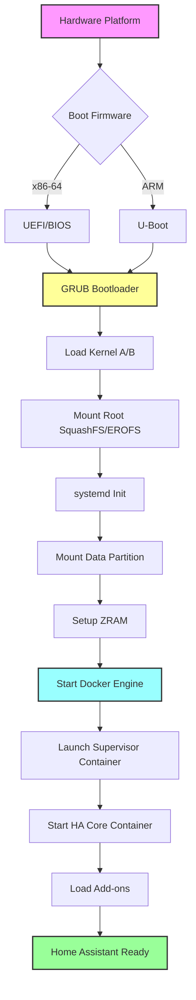
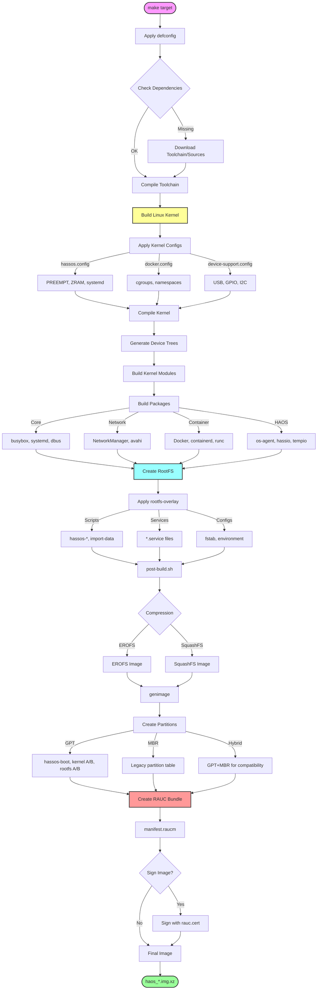
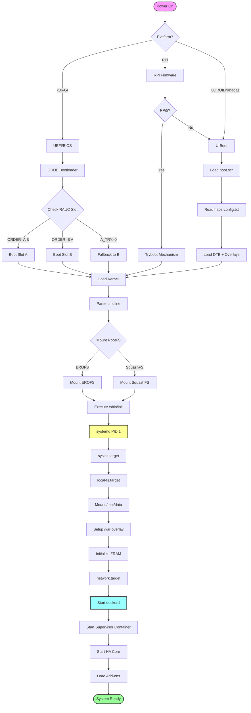
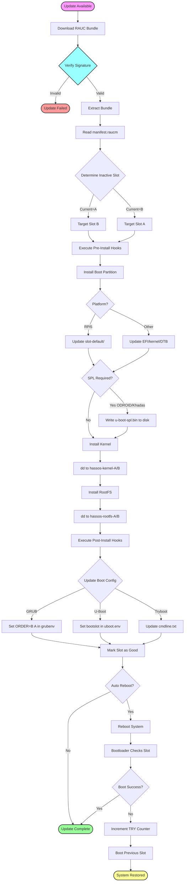
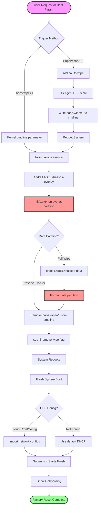
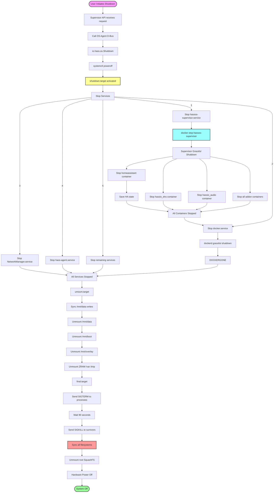
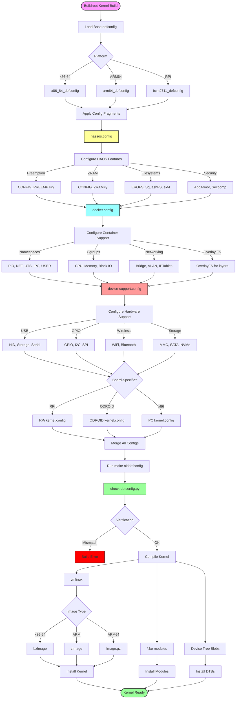
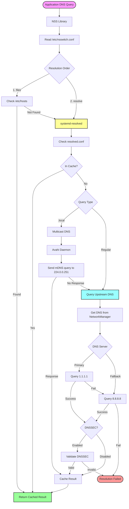

## Table of Contents

1. Executive Summary
2. Architecture Overview
3. Directory Structure
4. Build System
5. Boot Process Flow
6. Partition Layout
7. Core Components
8. Board-Specific Implementations
9. Update System (RAUC)
10. Container Platform
11. System Services
12. Scripts Deep Dive
13. Configuration Files
14. Testing Framework
15. Complete Boot-to-Shutdown Flow

---

## Executive Summary

Home Assistant Operating System (HAOS) is a minimalist Linux distribution built using **Buildroot** specifically designed to run Home Assistant in Docker containers. It provides:

- **Immutable root filesystem** (SquashFS/EROFS)
- **A/B partition scheme** for reliable OTA updates via RAUC
- **ZRAM-based volatile storage** for tmp, var, and swap
- **Docker Engine** for containerized Home Assistant components
- **Multi-platform support** (Raspberry Pi, x86-64, ODROID, Khadas, etc.)

### Complete System Data Flow

```mermaid
flowchart LR
    USER([User/Automation]) --> HAUI[Home Assistant UI/API]
    HAUI --> HACORE[HA Core Container]
    HACORE --> SUPERVISOR[Supervisor Container]
    
    SUPERVISOR --> SUPAPI[Supervisor API]
    SUPAPI -->|Config| NETMGR[NetworkManager]
    SUPAPI -->|System| OSAGENT[OS Agent D-Bus]
    SUPAPI -->|Update| RAUC[RAUC Update]
    SUPAPI -->|Containers| DOCKER[Docker Engine]
    
    DOCKER --> ADDONS[Add-on Containers]
    DOCKER --> DNS[DNS Container]
    DOCKER --> AUDIO[Audio Container]
    
    NETMGR --> NETWORK[Physical Network]
    OSAGENT --> SYSTEMD[systemd]
    RAUC --> BOOTLOADER[Bootloader GRUB/U-Boot]
    
    SYSTEMD --> KERNEL[Linux Kernel]
    BOOTLOADER --> KERNEL
    KERNEL --> HARDWARE[Hardware Platform]
    
    ADDONS --> DATA[/mnt/data Storage]
    HACORE --> DATA
    SUPERVISOR --> DATA
    
    style USER fill:#f9f,stroke:#333,stroke-width:2px
    style HACORE fill:#9f9,stroke:#333,stroke-width:2px
    style SUPERVISOR fill:#ff9,stroke:#333,stroke-width:2px
    style DOCKER fill:#9ff,stroke:#333,stroke-width:2px
    style KERNEL fill:#f99,stroke:#333,stroke-width:2px
    style HARDWARE fill:#ccc,stroke:#333,stroke-width:2px
```

---

- **ZRAM-based volatile storage** for tmp, var, and swap
- **Docker Engine** for containerized Home Assistant components
- **Multi-platform support** (Raspberry Pi, x86-64, ODROID, Khadas, etc.)

---

## Architecture Overview

```
┌─────────────────────────────────────────────────────────────────────┐
│                         User Space                                   │
├─────────────────────────────────────────────────────────────────────┤
│  ┌─────────────┐  ┌─────────────┐  ┌─────────────┐  ┌─────────────┐ │
│  │ Home        │  │ Supervisor  │  │ Add-ons     │  │ DNS/Audio/  │ │
│  │ Assistant   │  │             │  │             │  │ CLI/etc     │ │
│  │ Core        │  │             │  │             │  │             │ │
│  └──────┬──────┘  └──────┬──────┘  └──────┬──────┘  └──────┬──────┘ │
│         └─────────────────┴─────────────────┴─────────────────┘      │
│                              Docker Engine                           │
├─────────────────────────────────────────────────────────────────────┤
│                         Linux Kernel                                 │
├─────────────────────────────────────────────────────────────────────┤
│  ┌──────────┐  ┌──────────┐  ┌──────────┐  ┌──────────┐            │
│  │ Boot     │  │ Kernel   │  │ RootFS   │  │ Data     │            │
│  │ (FAT32)  │  │ (A/B)    │  │ (A/B)    │  │ (ext4)   │            │
│  └──────────┘  └──────────┘  └──────────┘  └──────────┘            │
├─────────────────────────────────────────────────────────────────────┤
│                    Bootloader (GRUB/U-Boot)                         │
└─────────────────────────────────────────────────────────────────────┘
```

### System Architecture Flowchart



---

## Directory Structure

### Root Level Files

#### Makefile

```makefile
# Build directory paths
BUILDDIR:=$(shell pwd)
BUILDROOT=$(BUILDDIR)/buildroot              # Buildroot submodule
BUILDROOT_EXTERNAL=$(BUILDDIR)/buildroot-external  # HAOS external tree
DEFCONFIG_DIR = $(BUILDROOT_EXTERNAL)/configs      # Board defconfigs

# Output directory - can be overridden with O=
ifneq ("$(origin O)", "command line")
O := $(BUILDDIR)/output
else
override O := $(BUILDDIR)/$(O)
endif

# Generate target list from defconfig files
# Each *_defconfig becomes a make target
TARGETS := $(notdir $(patsubst %_defconfig,%,$(wildcard $(DEFCONFIG_DIR)/*_defconfig)))
TARGETS_CONFIG := $(notdir $(patsubst %_defconfig,%-config,$(wildcard $(DEFCONFIG_DIR)/*_defconfig)))

# Main build target - runs Buildroot with HAOS external tree
$(TARGETS): %: %-config
    $(MAKE) -C $(BUILDROOT) O=$(O) BR2_EXTERNAL=$(BUILDROOT_EXTERNAL)

# Config target - applies defconfig
$(TARGETS_CONFIG): %-config:
    $(MAKE) -C $(BUILDROOT) O=$(O) BR2_EXTERNAL=$(BUILDROOT_EXTERNAL) "$*_defconfig"
```

**Flow:**

1. `make ova` → triggers `ova-config` first
2. `ova-config` → applies ova_defconfig
3. Then runs full Buildroot build with HAOS external packages

### Complete Build Process Flowchart



---

```dockerfile
FROM debian:bookworm

# Build environment setup
RUN apt-get update && apt-get install -y \
    bc binutils build-essential bzip2 cpio file git graphviz \
    help2man jq make ncurses-dev openssh-client patch perl pigz \
    python3 python3-matplotlib python-is-python3 qemu-utils rsync \
    skopeo sudo texinfo unzip vim wget zip docker.io

# Entry point script handles UID/GID mapping
COPY scripts/entry.sh /usr/sbin/
ENTRYPOINT ["/usr/sbin/entry.sh"]

WORKDIR /build
```

**Purpose:** Creates reproducible build environment with all dependencies.

#### LICENSE

Apache License 2.0 - Permits commercial use, modification, distribution.

---

## Build System

### Entry Point Scripts

#### enter.sh

```bash
#!/bin/bash
set -e

# Get host user's UID/GID for file permission mapping
BUILDER_UID="$(id -u)"
BUILDER_GID="$(id -g)"
CACHE_DIR="${CACHE_DIR:-$HOME/hassos-cache}"

# Prevent running as root (security)
if [ "$BUILDER_UID" -eq "0" ] || [ "$BUILDER_GID" == "0" ]; then
    echo "ERROR: Please run this script as a regular (non-root) user"
    exit 1
fi

# Build Docker image from Dockerfile
docker build -t hassos:local .

# Initialize Buildroot submodule if needed
if [ ! -f buildroot/Makefile ]; then
    git submodule update --init
fi

# Ensure loop devices exist (needed for image creation)
if command -v losetup >/dev/null && [ ! -e /dev/loop0 ]; then
    sudo losetup -f > /dev/null
fi

# Run build container with:
# - Privileged mode (for loop devices, Docker-in-Docker)
# - Volume mounts for source and cache
# - UID/GID mapping for file ownership
docker run -it --rm --privileged \
    -v "$(pwd):/build" -v "${CACHE_DIR}:/cache" \
    -e BUILDER_UID="${BUILDER_UID}" -e BUILDER_GID="${BUILDER_GID}" \
    hassos:local "${@:-bash}"
```

#### entry.sh

```bash
#!/bin/bash
set -e

USER="root"

# Start Docker daemon for Docker-in-Docker (container image building)
dockerd -s vfs &> /dev/null &

# Create builder group if GID specified and doesn't exist
if [ "${BUILDER_GID:-0}" -ne 0 ] && ! getent group "${BUILDER_GID:-0}"; then
    groupadd -g "${BUILDER_GID}" builder
fi

# Create builder user with matching UID/GID from host
if [ "${BUILDER_UID:-0}" -ne 0 ]; then
    useradd -m -u "${BUILDER_UID}" -g "${BUILDER_GID}" -G docker,sudo builder
    echo "builder ALL=(ALL:ALL) NOPASSWD: ALL" >> /etc/sudoers
    chown "${BUILDER_UID}:${BUILDER_GID}" /cache
    chown "${BUILDER_UID}:${BUILDER_GID}" /build/output || true
    USER="builder"
fi

# Execute command as appropriate user
if CMD="$(command -v "$1")"; then
    exec su -c "$CMD ${*:2}" "$USER"
fi
```

### Buildroot External Tree

#### external.desc

```
name: HASSOS
desc: Home Assistant Operating System
```

#### external.mk

```makefile
# Include all package makefiles
include $(sort $(wildcard $(BR2_EXTERNAL_HASSOS_PATH)/package/*/*.mk))

# Custom target: Verify kernel config matches fragments
.PHONY: linux-check-dotconfig
linux-check-dotconfig: linux-check-configuration-done
    CC=$(TARGET_CC) LD=$(TARGET_LD) srctree=$(LINUX_SRCDIR) \
    ARCH=$(if $(BR2_x86_64),x86,$(if $(BR2_aarch64),arm64,$(ARCH))) \
    $(BR2_EXTERNAL_HASSOS_PATH)/scripts/check-dotconfig.py \
        --src-kconfig $(LINUX_SRCDIR)Kconfig \
        --actual-config $(LINUX_SRCDIR).config \
        $(BR2_LINUX_KERNEL_CONFIG_FRAGMENT_FILES)
```

#### Config.in

Kconfig menu for HAOS-specific options (board selection, channels, etc.)

#### meta

```bash
# Global version and naming
HASSOS_ID="haos"
HASSOS_NAME="Home Assistant OS"
VERSION_MAJOR=14
VERSION_MINOR=0
VERSION_SUFFIX=""  # Empty for release, "dev1" for development
```

---

## Boot Process Flow

### Detailed Boot Sequence Flowchart



### Stage 1: Bootloader

#### GRUB (x86-64, Generic AArch64)

grub.cfg:

```grub
# Load environment variables for A/B boot selection
load_env

# Default to slot A, 3 second timeout
set default=0
set timeout=3

# Determine which slot to boot based on ORDER and retry counts
if [ "${ORDER}" = "A B" ]; then
    set default=0
    if [ "${A_TRY}" -gt 0 ]; then
        # A failed, try B
        set default=1
    fi
else
    set default=1
    if [ "${B_TRY}" -gt 0 ]; then
        set default=0
    fi
fi

menuentry "Slot A" {
    # Load kernel from kernel-A partition
    linux /kernel root=PARTUUID=<rootfs-a-uuid> rauc.slot=A
    boot
}

menuentry "Slot B" {
    linux /kernel root=PARTUUID=<rootfs-b-uuid> rauc.slot=B
    boot
}
```

#### U-Boot (ARM boards)

Boot script flow:

1. Load `boot.scr` from boot partition
2. Read `haos-config.txt` for overlay configuration
3. Load kernel, DTB, and overlays
4. Set kernel cmdline from cmdline.txt
5. Boot kernel

Example cmdline.txt:

```
console=ttyAML0,115200n8 console=tty0
```

#### Raspberry Pi 5 Tryboot

rpi-tryboot.sh:

```bash
#!/bin/sh
# Custom bootloader backend for RAUC using RPi5 tryboot mechanism

boot_dir="/mnt/boot"
root_slot_a="PARTUUID=8d3d53e3-6d49-4c38-8349-aff6859e82fd"
root_slot_b="PARTUUID=a3ec664e-32ce-4665-95ea-7ae90ce9aa20"

# Get current primary slot from cmdline
get_primary() {
    cmdline=$(head -n1 "${boot_dir}/cmdline.txt")
    get_value rauc.slot "${cmdline}"
}

case "$1" in
    get-primary)
        get_primary
        ;;
    set-primary)
        # Switch boot slot by modifying cmdline.txt
        slot_bootname="$2"
        # Update root= and rauc.slot= in cmdline
        ;;
    get-state)
        # Check if slot is marked good
        slot_bootname="$2"
        if [ -f "${boot_dir}/slot-${slot_bootname}/.good" ]; then
            echo "good"
        else
            echo "bad"
        fi
        ;;
    set-state)
        # Mark slot as good/bad
        slot_bootname="$2"
        new_state="$3"
        if [ "${new_state}" = "good" ]; then
            touch "${boot_dir}/slot-${slot_bootname}/.good"
        else
            rm -f "${boot_dir}/slot-${slot_bootname}/.good"
        fi
        ;;
esac
```

### Stage 2: Kernel Boot

The kernel boots with these key parameters:

- `root=PARTUUID=<uuid>` - Root filesystem partition
- `rauc.slot=A|B` - Current boot slot
- `rootfstype=squashfs` - Read-only compressed root

### Stage 3: Init System (systemd)

After kernel mounts root, systemd takes over:

1. **Early boot targets**
   
   - Mount essential filesystems (proc, sys, dev)
   - Set up ZRAM devices
2. **Local filesystems**
   
   - Mount boot partition at `/mnt/boot`
   - Mount data partition at `/mnt/data`
   - Set up overlay filesystem for `/mnt/overlay`
3. **System services**
   
   - Start Docker daemon
   - Start Home Assistant services

---

## Partition Layout

### Partition Layout Flowchart

```mermaid
flowchart TD
    DISK([Physical Disk]) --> GPT{Partition Table}
    GPT -->|Modern| GPTLAYOUT[GPT Layout]
    GPT -->|Legacy| MBRLAYOUT[MBR Layout]
    GPT -->|Compatibility| HYBRIDLAYOUT[Hybrid GPT+MBR]
    
    GPTLAYOUT --> P1[1: hassos-boot 32-96MB FAT32]
    MBRLAYOUT --> P1
    HYBRIDLAYOUT --> P1
    
    P1 --> BOOTCONTENT[Boot Partition Contents]
    BOOTCONTENT -->|x86-64| EFI[EFI/BOOT/bootx64.efi]
    BOOTCONTENT -->|ARM| UBOOTFILES[u-boot.bin, boot.scr]
    BOOTCONTENT -->|RPi| RPIFILES[config.txt, cmdline.txt]
    EFI --> P2
    UBOOTFILES --> P2
    RPIFILES --> P2
    
    P2[2: hassos-kernel-A 24MB Raw]
    P2 --> KERNELA[Kernel Image Slot A]
    KERNELA --> P3[3: hassos-rootfs-A 256MB]
    P3 --> ROOTFSA{Compression}
    ROOTFSA -->|Modern| EROFA[EROFS compressed read-only]
    ROOTFSA -->|Legacy| SQFSA[SquashFS compressed read-only]
    
    EROFA --> P4
    SQFSA --> P4[4: hassos-kernel-B 24MB Raw]
    P4 --> KERNELB[Kernel Image Slot B]
    KERNELB --> P5[5: hassos-rootfs-B 256MB]
    
    P5 --> ROOTFSB{Compression}
    ROOTFSB -->|Modern| EROFB[EROFS compressed read-only]
    ROOTFSB -->|Legacy| SQFSB[SquashFS compressed read-only]
    
    EROFB --> P6
    SQFSB --> P6[6: hassos-bootstate 8MB Raw]
    P6 --> BOOTSTATE[U-Boot environment variables]
    BOOTSTATE --> P7[7: hassos-overlay 96MB ext4]
    
    P7 --> OVERLAY[Persistent Overlay Storage]
    OVERLAY --> OVLCONTENT[/etc configs, SSH keys]
    OVLCONTENT --> P8[8: hassos-data Remaining ext4]
    
    P8 --> DATA[User Data Partition]
    DATA --> DATACONTENT[Docker volumes, Supervisor data]
    DATACONTENT --> STRUCTURE[Data Partition Structure]
    
    STRUCTURE --> DOCKER[/mnt/data/docker/]
    STRUCTURE --> SUPERVISOR[/mnt/data/supervisor/]
    STRUCTURE --> HOMEASSISTANT[/mnt/data/homeassistant/]
    
    DOCKER --> DOCKERDATA[containers, volumes, images]
    SUPERVISOR --> SUPDATA[backups, addons, network]
    HOMEASSISTANT --> HADATA[config, database]
    
    style DISK fill:#f9f,stroke:#333,stroke-width:2px
    style P1 fill:#ff9,stroke:#333,stroke-width:2px
    style P3 fill:#9ff,stroke:#333,stroke-width:2px
    style P5 fill:#9ff,stroke:#333,stroke-width:2px
    style P7 fill:#f99,stroke:#333,stroke-width:2px
    style P8 fill:#9f9,stroke:#333,stroke-width:2px
```

### GPT Partition Table (x86-64, modern ARM)

| # | Label | Size | Filesystem | Purpose |
|---|-------|------|------------|---------|
| 1 | hassos-boot | 32-96MB | FAT32 | Bootloader, kernel, DTBs |
| 2 | hassos-kernel-A | 24MB | Raw | Kernel image slot A |
| 3 | hassos-rootfs-A | 256MB | SquashFS/EROFS | Root filesystem slot A |
| 4 | hassos-kernel-B | 24MB | Raw | Kernel image slot B |
| 5 | hassos-rootfs-B | 256MB | SquashFS/EROFS | Root filesystem slot B |
| 6 | hassos-bootstate | 8MB | Raw | U-Boot environment |
| 7 | hassos-overlay | 96MB | ext4 | Persistent overlay |
| 8 | hassos-data | Remaining | ext4 | User data, Docker |

### Size Definitions

hdd-image.sh:

```bash
BOOTSTATE_SIZE=8M
SYSTEM_SIZE=256M      # Root filesystem
KERNEL_SIZE=24M
OVERLAY_SIZE=96M
DATA_SIZE=1280M       # Initial data partition (grows on first boot)
```

---

## Core Components

### RAUC Update System

### RAUC Update Flowchart



#### Configuration Template

system.conf.gtpl:

```ini
[system]
compatible={{ env "ota_compatible" }}  # e.g., "haos-rpi4-64"
mountprefix=/run/rauc
statusfile=/mnt/boot/rauc.db

# Bootloader type varies by platform
{{- if eq (env "BOOTLOADER") "tryboot" }}
bootloader=custom
{{- else }}
bootloader={{ env "BOOTLOADER" }}  # grub, uboot
{{- end }}

{{- if eq (env "BOOTLOADER") "grub" }}
grubenv=/mnt/boot/EFI/BOOT/grubenv
{{- end }}

{{- if eq (env "BOOTLOADER") "tryboot" }}
[handlers]
bootloader-custom-backend=/usr/lib/rauc/rpi-tryboot.sh
{{- end }}

[keyring]
path=/etc/rauc/keyring.pem  # Certificate for verifying updates

# Slot definitions
[slot.boot.0]
device=/dev/disk/by-partlabel/hassos-boot
type=vfat
allow-mounted=true

[slot.kernel.0]
device=/dev/disk/by-partlabel/hassos-kernel-A
type=raw
bootname=A

[slot.kernel.1]
device=/dev/disk/by-partlabel/hassos-kernel-B
type=raw
bootname=B

[slot.rootfs.0]
device=/dev/disk/by-partlabel/hassos-rootfs-A
type=raw
bootname=A

[slot.rootfs.1]
device=/dev/disk/by-partlabel/hassos-rootfs-B
type=raw
bootname=B
```

#### RAUC Hook Script

rauc-hook:

```bash
#!/bin/sh
set -o errexit

# Install boot partition contents
install_boot() {
    BOOT_TMP=/tmp/boot-tmp
    BOOT_NEW=/tmp/boot-new
    BOOT_MNT=/mnt/boot

    mkdir -p "${BOOT_TMP}" "${BOOT_NEW}"

    # Mount current boot and new image
    systemctl start mnt-boot.mount
    mount "${RAUC_IMAGE_NAME}" "${BOOT_NEW}"
    trap cleanup_boot EXIT

    # Remove old overlays, copy new contents
    rm -f "${BOOT_MNT}"/overlays/* || true

    if [ "$RAUC_SYSTEM_COMPATIBLE" = "haos-rpi5-64" ]; then
        # RPi5 uses slot-based kernel/DTB storage
        rm -rf "${BOOT_MNT}/slot-default"
        cp -r "${BOOT_NEW}/slot-A" "${BOOT_MNT}/slot-default"
    else
        # Standard: backup config, copy new, restore config
        cp -f "${BOOT_MNT}"/*.txt "${BOOT_TMP}/" || true
        cp -f "${BOOT_MNT}"/EFI/BOOT/grubenv "${BOOT_TMP}/" || true
        cp -rf "${BOOT_NEW}"/* "${BOOT_MNT}/"
        cp -f "${BOOT_TMP}"/*.txt "${BOOT_MNT}/" || true
        cp -f "${BOOT_TMP}"/grubenv "${BOOT_MNT}"/EFI/BOOT/ || true
    fi
}

# Install SPL (Secondary Program Loader) for boards that need it
install_spl() {
    DEVICE_CHILD="$(findfs LABEL="hassos-boot")"
    DEVICE_ROOT="/dev/$(lsblk -no pkname "${DEVICE_CHILD}")"
    PART_TABLE="$(sfdisk -lqJ "${DEVICE_ROOT}")"
    PART_LABEL="$(echo "${PART_TABLE}" | jq -r '.partitiontable.label')"

    # Write bootloader to disk start (before first partition)
    if [ "${PART_LABEL}" = "gpt" ]; then
        dd if="${RAUC_IMAGE_NAME}" of="${DEVICE_ROOT}" conv=notrunc bs=512 seek=64 skip=64
    else
        # MBR: preserve partition table in first 440 bytes
        dd if="${RAUC_IMAGE_NAME}" of="${DEVICE_ROOT}" conv=notrunc bs=1 count=440
        dd if="${RAUC_IMAGE_NAME}" of="${DEVICE_ROOT}" conv=notrunc bs=512 seek=1 skip=1
    fi
}

# Hook entry points
case "$1" in
    install-check)
        # Verify update is compatible
        if [ "$RAUC_MF_COMPATIBLE" = "$RAUC_SYSTEM_COMPATIBLE" ]; then
            check_grubenv  # Verify GRUB env isn't corrupted
            exit 0
        fi
        echo "Compatible does not match!" 1>&2
        exit 10
        ;;
    slot-install)
        # Called when installing to boot or spl slot
        if [ "${RAUC_SLOT_CLASS}" = "boot" ]; then
            install_boot
        elif [ "${RAUC_SLOT_CLASS}" = "spl" ]; then
            install_spl
        fi
        ;;
    slot-post-install)
        # Post-installation hooks
        ;;
esac
```

#### RAUC Bundle Manifest

manifest.raucm.gtpl:

```ini
[update]
compatible={{ env "ota_compatible" }}  # Must match system compatible
version={{ env "ota_version" }}         # Semantic version

[bundle]
format=verity  # Integrity verification

[hooks]
filename=hook
hooks=install-check;  # Run compatibility check

[image.boot]
filename=boot.vfat
hooks=install;  # Custom install handler

[image.kernel]
filename=kernel.img
{{- if eq (env "BOOTLOADER") "tryboot" }}
hooks=post-install;
{{- end }}

[image.rootfs]
filename=rootfs.img

{{- if eq (env "BOOT_SPL") "true" }}
[image.spl]
filename=spl.img
hooks=install
{{- end }}
```

### Docker/Hassio Package

### Docker & Supervisor Startup Flowchart

```mermaid
flowchart TD
    SYSINIT([systemd sysinit]) --> DATAMOUNT[Mount /mnt/data ext4]
    DATAMOUNT --> OVERLAY[Setup /var overlay]
    OVERLAY --> ZRAM[Create ZRAM devices]
    ZRAM --> NETWORK[network.target]
    
    NETWORK --> DOCKERPREP[hassos-docker-prepare.service]
    DOCKERPREP --> GRAPHDIR[Create /mnt/data/docker]
    GRAPHDIR --> CONFIGGEN[Generate daemon.json]
    CONFIGGEN --> DOCKERD[Start dockerd.service]
    
    DOCKERD --> DOCKERREADY[Docker Engine Running]
    DOCKERREADY --> SUPSERVICE[hassos-supervisor.service]
    
    SUPSERVICE --> MARKER{Check /run/supervisor/boot}
    MARKER -->|Exists| CORRUPT[Assume Corruption]
    MARKER -->|Missing| CHECK
    CORRUPT --> REMOVE[Remove Container]
    REMOVE --> CREATE
    
    CHECK --> CONTAINER{Container Exists?}
    CONTAINER -->|No| CREATE[Create Supervisor Container]
    CONTAINER -->|Yes| START[docker start hassos-supervisor]
    
    CREATE --> DOCKER_CREATE[docker create params]
    DOCKER_CREATE --> VOLUMES[Mount Volumes]
    VOLUMES -->|/mnt/data| V1[/data]
    VOLUMES -->|/run/dbus| V2[/run/dbus]
    VOLUMES -->|/run/udev| V3[/run/udev]
    VOLUMES -->|/etc/machine-id| V4[/etc/machine-id]
    V1 --> DEVICES
    V2 --> DEVICES
    V3 --> DEVICES
    V4 --> DEVICES[Mount Devices]
    
    DEVICES -->|/dev/disk/by-label| D1[All partitions]
    DEVICES -->|/dev/ttyAMA0| D2[Serial console]
    DEVICES -->|/dev/mem| D3[Physical memory]
    D1 --> CAPS
    D2 --> CAPS
    D3 --> CAPS[Set Capabilities]
    
    CAPS --> CAP_SYS_ADMIN[CAP_SYS_ADMIN]
    CAPS --> CAP_SYS_RAWIO[CAP_SYS_RAWIO]
    CAPS --> CAP_SYS_BOOT[CAP_SYS_BOOT]
    CAP_SYS_ADMIN --> STARTC
    CAP_SYS_RAWIO --> STARTC
    CAP_SYS_BOOT --> STARTC[docker start hassos-supervisor]
    
    START --> SUPERVISE[Supervisor Entrypoint]
    STARTC --> SUPERVISE
    SUPERVISE --> SUPINIT[Initialize Supervisor]
    SUPINIT --> APIDBUS[Start D-Bus API]
    APIDBUS --> LOADPLUG[Load Plugins]
    LOADPLUG -->|DNS| DNSPLUG[Start DNS Add-on]
    LOADPLUG -->|Audio| AUDIOPLUG[Start Audio Add-on]
    LOADPLUG -->|CLI| CLIPLUG[Start CLI Add-on]
    
    DNSPLUG --> HACORE
    AUDIOPLUG --> HACORE
    CLIPLUG --> HACORE[Start HA Core Container]
    HACORE --> HACOREINIT[Load integrations]
    HACOREINIT --> ADDONS[Load User Add-ons]
    ADDONS --> READY([System Ready])
    
    style SYSINIT fill:#f9f,stroke:#333,stroke-width:2px
    style READY fill:#9f9,stroke:#333,stroke-width:2px
    style DOCKERD fill:#ff9,stroke:#333,stroke-width:2px
    style SUPERVISE fill:#9ff,stroke:#333,stroke-width:2px
    style HACORE fill:#f99,stroke:#333,stroke-width:2px
```

#### Package Definition

hassio.mk:

```makefile
HASSIO_VERSION = 1.0.0
HASSIO_LICENSE = Apache License 2.0
HASSIO_SITE = $(BR2_EXTERNAL_HASSOS_PATH)/package/hassio
HASSIO_SITE_METHOD = local

# Version channel selection
ifeq ($(BR2_PACKAGE_HASSIO_CHANNEL_STABLE),y)
HASSIO_VERSION_CHANNEL = "stable"
else ifeq ($(BR2_PACKAGE_HASSIO_CHANNEL_BETA),y)
HASSIO_VERSION_CHANNEL = "beta"
else ifeq ($(BR2_PACKAGE_HASSIO_CHANNEL_DEV),y)
HASSIO_VERSION_CHANNEL = "dev"
endif

# Container images to fetch
HASSIO_CONTAINER_IMAGES_ARCH = supervisor dns audio cli multicast observer core

# Fetch version.json and set core to landing page
define HASSIO_CONFIGURE_CMDS
    curl -s $(HASSIO_VERSION_URL)$(HASSIO_VERSION_CHANNEL)".json" | \
        jq '.core = "landingpage"' > $(@D)/version.json
endef

# Download all container images
define HASSIO_BUILD_CMDS
    mkdir -p $(@D)/images $(HASSIO_DL_DIR)
    $(foreach image,$(HASSIO_CONTAINER_IMAGES_ARCH),\
        $(BR2_EXTERNAL_HASSOS_PATH)/package/hassio/fetch-container-image.sh \
            $(BR2_PACKAGE_HASSIO_ARCH) $(BR2_PACKAGE_HASSIO_MACHINE) \
            $(@D)/version.json $(image) "$(HASSIO_DL_DIR)" "$(@D)/images"
    )
endef

# Create data partition with pre-loaded containers
define HASSIO_INSTALL_IMAGES_CMDS
    $(BR2_EXTERNAL_HASSOS_PATH)/package/hassio/create-data-partition.sh \
        "$(@D)" "$(BINARIES_DIR)" "$(HASSIO_VERSION_CHANNEL)" "$(DOCKER_ENGINE_VERSION)"
endef
```

#### Data Partition Creation

create-data-partition.sh:

```bash
#!/usr/bin/env bash
set -e

build_dir=$1
dst_dir=$2
channel=$3
docker_version=$4

data_img="${dst_dir}/data.ext4"
data_dir="${build_dir}/data"

# Create empty ext4 image
rm -f "${data_img}"
truncate --size="1280M" "${data_img}"
mkfs.ext4 -L "hassos-data" -E lazy_itable_init=0,lazy_journal_init=0 "${data_img}"

# Mount and populate
mkdir -p "${data_dir}"
sudo mount -o loop,discard "${data_img}" "${data_dir}"

trap 'docker rm -f ${container} > /dev/null; sudo umount ${data_dir} || true' ERR EXIT

# Start Docker-in-Docker to import container images
container=$(docker run --privileged -e DOCKER_TLS_CERTDIR="" \
    -v "${data_dir}":/mnt/data \
    docker:${docker_version}-dind)

# Import pre-downloaded container images
docker exec ${container} /build/images/import-containers.sh
```

#### Container Import Script

dind-import-containers.sh:

```bash
#!/bin/sh
set -e

# Wait for Docker daemon
echo "Waiting for Docker daemon..."
while ! docker version 2> /dev/null > /dev/null; do
    sleep 1
done

# Load container images (largest first to ensure space)
echo "Loading container images..."
for image in $(ls -S /build/images/*.tar); do
    docker load --input "${image}"
done

# Tag Supervisor with expected name
supervisor=$(docker images --filter "label=io.hass.type=supervisor" --quiet)
arch=$(docker inspect --format '{{ index .Config.Labels "io.hass.arch" }}' "${supervisor}")
docker tag "${supervisor}" "ghcr.io/home-assistant/${arch}-hassio-supervisor:latest"
```

---

## Board-Specific Implementations

### Raspberry Pi 4/5

#### Config.txt

config.txt:

```ini
# Firmware configuration
disable_splash=1          # No rainbow splash
kernel=u-boot.bin         # Load U-Boot as "kernel"

# Uncomment for 64-bit mode (done automatically by build)
#arm_64bit=1

# UART console (uncomment to enable)
#enable_uart=1

# HDMI safe mode for problematic displays
#hdmi_safe=1

# Overscan adjustments
#disable_overscan=1
#overscan_left=16
```

#### Hook Script

hassos-hook.sh:

```bash
#!/bin/bash

function hassos_pre_image() {
    local BOOT_DATA="$(path_boot_dir)"

    # Copy bootloader and firmware
    cp -t "${BOOT_DATA}" \
        "${BINARIES_DIR}/u-boot.bin" \
        "${BINARIES_DIR}/boot.scr"
    cp "${BINARIES_DIR}"/*.dtb "${BOOT_DATA}/"
    cp -r "${BINARIES_DIR}/rpi-firmware/"* "${BOOT_DATA}/"

    # Copy config files
    if [ -f "${BOARD_DIR}/config.txt" ]; then
        cp "${BOARD_DIR}/config.txt" "${BOOT_DATA}/config.txt"
    else
        cp "${BOARD_DIR}/../config.txt" "${BOOT_DATA}/config.txt"
    fi

    # Copy device tree overlays
    if ls "${BINARIES_DIR}"/*.dtbo >/dev/null 2>&1; then
        mkdir -p "${BOOT_DATA}/overlays"
        cp "${BINARIES_DIR}"/*.dtbo "${BOOT_DATA}/overlays/"
    fi

    # Enable 64-bit mode if building 64-bit image
    if [[ "${BOARD_ID}" =~ "64" ]]; then
        sed -i "s|#arm_64bit|arm_64bit|g" "${BOOT_DATA}/config.txt"
    fi
}

function hassos_post_image() {
    # Compress final image with xz
    convert_disk_image_xz
}
```

### Raspberry Pi 5 (Tryboot)

hassos-hook.sh:

```bash
#!/bin/bash

function hassos_pre_image() {
    local BOOT_DATA="$(path_boot_dir)"

    # RPi5 uses slot-based boot (A/B in separate directories)
    mkdir -p "${BOOT_DATA}/slot-A/"

    # Copy kernel and DTBs to slot directory
    cp "${BINARIES_DIR}"/*.dtb "${BOOT_DATA}/slot-A/"
    gzip --stdout "${BINARIES_DIR}"/Image > "${BOOT_DATA}/slot-A/kernel_2712.img"
    cp -r "${BINARIES_DIR}/overlays/" "${BOOT_DATA}/slot-A/"

    # README must exist for os_prefix to work correctly
    touch "${BOOT_DATA}/slot-A/overlays/README"

    # Copy board-specific config
    cp "${BOARD_DIR}/config.txt" "${BOOT_DATA}/config.txt"
    cp "${BOARD_DIR}/cmdline.txt" "${BOOT_DATA}/cmdline.txt"
}
```

### Home Assistant Yellow

config.txt:

```ini
# Yellow-specific configuration
disable_splash=1
kernel=u-boot.bin
arm_64bit=1

# Yellow has no HDMI but needs codecs
enable_uart=1
gpu_mem=32

# CM4 module overrides
[cm4]
otg_mode=1
```

### Generic x86-64

hassos-hook.sh:

```bash
#!/bin/bash

function hassos_pre_image() {
    local BOOT_DATA="$(path_boot_dir)"
    local EFIPART_DATA="${BINARIES_DIR}/efi-part"

    mkdir -p "${BOOT_DATA}/EFI/BOOT"

    # Copy GRUB config
    cp "${BOARD_DIR}/../grub.cfg" "${EFIPART_DATA}/EFI/BOOT/grub.cfg"
    cp "${BOARD_DIR}/cmdline.txt" "${EFIPART_DATA}/cmdline.txt"

    # Initialize GRUB environment
    grub-editenv "${EFIPART_DATA}/EFI/BOOT/grubenv" create
    grub-editenv "${EFIPART_DATA}/EFI/BOOT/grubenv" set ORDER="A B"
    grub-editenv "${EFIPART_DATA}/EFI/BOOT/grubenv" set A_OK=1
    grub-editenv "${EFIPART_DATA}/EFI/BOOT/grubenv" set A_TRY=0

    cp -r "${EFIPART_DATA}/"* "${BOOT_DATA}/"
}

function hassos_post_image() {
    convert_disk_image_xz
}
```

### OVA (Virtual Appliance)

hassos-hook.sh:

```bash
function hassos_post_image() {
    local hdd_img="$(hassos_image_name img)"

    # Create multiple virtual disk formats
    convert_disk_image_virtual vmdk
    convert_disk_image_virtual vhdx
    convert_disk_image_virtual vdi
    convert_disk_image_virtual qcow2

    # Compress each format
    convert_disk_image_zip vmdk
    convert_disk_image_zip vhdx
    convert_disk_image_zip vdi
    convert_disk_image_xz qcow2

    # Create OVA package (VMware/VirtualBox compatible)
    convert_disk_image_ova

    # Cleanup raw image
    rm -f "${hdd_img}"
}
```

### ODROID Boards

#### ODROID-C4

hassos-hook.sh:

```bash
function hassos_pre_image() {
    local BOOT_DATA="$(path_boot_dir)"

    cp "${BINARIES_DIR}/boot.scr" "${BOOT_DATA}/boot.scr"
    cp "${BINARIES_DIR}/meson-sm1-odroid-c4.dtb" "${BOOT_DATA}/"

    # Device tree overlays
    mkdir -p "${BOOT_DATA}/overlays"
    cp "${BINARIES_DIR}"/*.dtbo "${BOOT_DATA}/overlays/"

    # Board configuration
    cp "${BOARD_DIR}/boot-env.txt" "${BOOT_DATA}/haos-config.txt"
    cp "${BOARD_DIR}/cmdline.txt" "${BOOT_DATA}/cmdline.txt"
}
```

#### Hardkernel Boot Package

hardkernel-boot.mk:

```makefile
# ODROID-C4 uses SM1 SoC (same family as S905X3)
ifeq ($(BR2_PACKAGE_HARDKERNEL_BOOT_ODROID_C4),y)
HARDKERNEL_BOOT_VERSION = 2a4e31e3fde9bced8a150d338aa397a0362df191
HARDKERNEL_BOOT_BINS += u-boot.sm1

define HARDKERNEL_BOOT_BUILD_CMDS
    # Download Amlogic firmware blobs
    curl -L -o $(@D)/fip/blx_fix.sh <url>/blx_fix_g12a.sh
    curl -L -o $(@D)/fip/acs.bin <url>/odroid-c4/acs.bin
    curl -L -o $(@D)/fip/bl301.bin <url>/odroid-c4/bl301.bin

    # Sign and package bootloader
    bash $(@D)/fip/blx_fix.sh ...

    # Create final u-boot image with all firmware
    $(@D)/fip/g12a/aml_encrypt_g12a --bl30sig ...
    $(@D)/fip/g12a/aml_encrypt_g12a --bl3sig ...
    $(@D)/fip/g12a/aml_encrypt_g12a --bl2sig ...
    $(@D)/fip/g12a/aml_encrypt_g12a --bootmk \
        --output $(@D)/fip/u-boot.bin \
        --bl2 $(@D)/fip/bl2.n.bin.sig \
        --bl30 $(@D)/fip/bl30_new.bin.enc \
        --bl31 $(@D)/fip/bl31.img.enc \
        --bl33 $(@D)/fip/bl33.bin.enc \
        --ddrfw1-9 ...

    cp $(@D)/fip/u-boot.bin $(@D)/u-boot.sm1
endef
endif
```

### Khadas VIM3

khadas-boot.mk:

```makefile
KHADAS_BOOT_VERSION = 251220
KHADAS_BOOT_BINS += u-boot.gxl
KHADAS_BOOT_FIP_DIR = $(@D)/VIM3

define KHADAS_BOOT_BUILD_CMDS
    # Copy firmware from Khadas FIP package
    mkdir -p $(@D)/fip
    cp $(KHADAS_BOOT_FIP_DIR)/bl301.bin $(@D)/fip/
    cp $(KHADAS_BOOT_FIP_DIR)/acs.bin $(@D)/fip/
    cp $(KHADAS_BOOT_FIP_DIR)/bl2.bin $(@D)/fip/
    cp $(KHADAS_BOOT_FIP_DIR)/bl30.bin $(@D)/fip/
    cp $(KHADAS_BOOT_FIP_DIR)/bl31.img $(@D)/fip/
    cp $(KHADAS_BOOT_FIP_DIR)/ddr*.fw $(@D)/fip/
    cp $(BINARIES_DIR)/u-boot.bin $(@D)/fip/bl33.bin

    # Sign bootloader components
    cd $(@D); $(KHADAS_BOOT_FIP_DIR)/blx_fix.sh \
        fip/bl30.bin fip/zero_tmp fip/bl30_zero.bin \
        fip/bl301.bin fip/bl301_zero.bin fip/bl30_new.bin bl30

    cd $(@D); $(KHADAS_BOOT_FIP_DIR)/blx_fix.sh \
        fip/bl2.bin fip/zero_tmp fip/bl2_zero.bin \
        fip/acs.bin fip/bl21_zero.bin fip/bl2_new.bin bl2

    # Encrypt and sign
    cd $(@D); $(KHADAS_BOOT_FIP_DIR)/aml_encrypt_g12b --bl30sig ...
    cd $(@D); $(KHADAS_BOOT_FIP_DIR)/aml_encrypt_g12b --bl3sig ...
    cd $(@D); $(KHADAS_BOOT_FIP_DIR)/aml_encrypt_g12b --bl2sig ...

    # Create final bootloader
    cd $(@D); $(KHADAS_BOOT_FIP_DIR)/aml_encrypt_g12b --bootmk \
        --output fip/u-boot.bin \
        --bl2 fip/bl2.n.bin.sig \
        --bl30 fip/bl30_new.bin.enc \
        --bl31 fip/bl31.img.enc \
        --bl33 fip/bl33.bin.enc \
        --ddrfw1-9 fip/*.fw \
        --level v3

    cp -f $(@D)/fip/u-boot.bin.sd.bin $(@D)/u-boot.gxl
endef
```

### Home Assistant Green

hassos-hook.sh:

```bash
function hassos_pre_image() {
    local BOOT_DATA="$(path_boot_dir)"

    cp "${BINARIES_DIR}/boot.scr" "${BOOT_DATA}/boot.scr"
    cp "${BINARIES_DIR}"/*.dtb "${BOOT_DATA}/"

    cp "${BOARD_DIR}/boot-env.txt" "${BOOT_DATA}/haos-config.txt"
    cp "${BOARD_DIR}/cmdline.txt" "${BOOT_DATA}/cmdline.txt"
}
```

cmdline.txt:

```
console=ttyS2,1500000n8 console=tty0
```

---

## System Services

### Root Filesystem Overlay

rootfs-overlay contains files installed directly to the root filesystem.

### Home Assistant CLI

ha:

```bash
#!/bin/sh
# Wrapper to execute HA CLI inside the CLI container

if [ -t 1 ]; then
    # Interactive terminal - allocate TTY
    docker exec -it hassio_cli ha "$@"
else
    # Non-interactive
    docker exec -i hassio_cli ha "$@"
fi
```

### HAOS CLI Shell

hassos-cli:

```bash
#!/bin/sh
# Login shell script - waits for HA CLI to be ready

run_shell() { exec /bin/ash -l; }
interrupt() { echo " cancelled"; systemctl reset-failed "ha-cli@*"; run_shell; }
emergency_shell() {
    printf "\n\n[WARNING] Home Assistant CLI is not starting or was interrupted.\n"
    echo "This happens when start of all services takes longer than expected"
    echo "Emergency console commands:"
    echo " * 'docker ps -a' - check container status"
    echo " * 'journalctl -e' - view system logs"
    echo " * 'exit' - retry HA CLI startup"
    run_shell
}

trap interrupt INT

printf "Waiting for the Home Assistant CLI to be ready..."

# Wait up to 5 minutes for CLI container
i=0
while [ $i -lt 300 ]; do
    if docker exec -it hassio_cli ha > /dev/null 2>&1; then
        exec docker exec -it hassio_cli ha
    fi
    sleep 1
    i=$((i + 1))
    printf "."
done

emergency_shell
```

### Swap Management

haos-swapfile:

```bash
#!/bin/sh
set -e

# Convert human-readable size to kilobytes
size2kilobytes() {
    bytes="$(echo "$1" | awk \
      'BEGIN{IGNORECASE = 1}
       function tobytes(n,b,p) {printf "%u\n", n*b^p/1024}
       /[0-9]B?$/{tobytes($1,  1, 0); next};
       /K(i?B)?$/{tobytes($1,  2, 10); next};
       /M(i?B)?$/{tobytes($1,  2, 20); next};
       /G(i?B)?$/{tobytes($1,  2, 30); next};
       {print -1}')"
    echo "$bytes"
}

# Load user configuration
if [ -f /etc/default/haos-swapfile ]; then
    . /etc/default/haos-swapfile
fi
SWAPFILE="/mnt/data/swapfile"

# Convert size to kilobytes
SWAPSIZE="$(size2kilobytes "${SWAPSIZE}")"
SWAPSIZE_TOLERANCE=0

if [ -z "${SWAPSIZE}" ] || [ "${SWAPSIZE}" = "-1" ]; then
    # Default: 33% of RAM
    SWAPSIZE="$(awk '/MemTotal/{ print int($2 * 0.33) }' /proc/meminfo)"
    echo "[INFO] Using default swapsize of 33% RAM (${SWAPSIZE} kB)"
    SWAPSIZE_TOLERANCE=$((32*1024))  # 32MB tolerance for fluctuations
fi

SWAPSIZE_BLOCKS=$((SWAPSIZE / 4))

if [ "${SWAPSIZE_BLOCKS}" -lt 10 ]; then
    echo "[INFO] Requested swap size smaller than 40kB, disabling swap"
    [ -f "${SWAPFILE}" ] && rm -f "${SWAPFILE}"
    exit 0
fi

# Create or resize swapfile as needed
# ... (creation logic)
```

### ZRAM Setup

hassos-zram:

```bash
#!/bin/sh
set -e

TYPE=""
MOUNT=""
DEVICE=""
SIZE=0

# Parse arguments
while [ "$1" != "" ]; do
    case $1 in
        -t|--type) TYPE=$2; shift ;;
        -s|--size) SIZE=$2; shift ;;
        -m|--mount) MOUNT=$2; shift ;;
    esac
    shift
done

# Device assignment
if [ "$TYPE" = "swap" ]; then
    DEVICE="/dev/zram0"
elif [ "$MOUNT" = "var" ]; then
    DEVICE="/dev/zram1"
elif [ "$MOUNT" = "tmp" ]; then
    DEVICE="/dev/zram2"
fi

# Configure ZRAM device
echo lz4 > /sys/block/$(basename $DEVICE)/comp_algorithm
echo $SIZE > /sys/block/$(basename $DEVICE)/disksize

if [ "$TYPE" = "swap" ]; then
    mkswap $DEVICE
    swapon -p 100 $DEVICE
else
    mkfs.ext4 $DEVICE
    mount $DEVICE $MOUNT
fi
```

### Data Disk Detach (Yellow-specific)

haos-data-disk-detach:

```bash
#!/bin/sh
# Handle NVMe data disk on Yellow

rootpart=$(rdev | cut -f 1 -d ' ')
rootdev=$(lsblk -no pkname "${rootpart}")

# Wait for device enumeration
sleep 10s

datapartitions=$(blkid --match-token LABEL="hassos-data" --output device)

. /etc/os-release

disable_data_partition() {
    e2label "${1}" hassos-data-dis
}

if [ "$VARIANT_ID" = "yellow" ]; then
    for datapart in ${datapartitions}; do
        datadev=$(lsblk -no pkname "${datapart}")
        case "${datadev}" in
            mmc*)
                # Internal eMMC - keep if root is on eMMC
                if [ "$rootdev" = "$datadev" ]; then
                    emmc_data_partition="${datapart}"
                fi
                ;;
            nvme0*)
                # NVMe data disk takes priority
                nvme_data_partition="${datapart}"
                ;;
        esac
    done

    # If NVMe present, disable eMMC data partition
    if [ -n "$nvme_data_partition" ] && [ -n "$emmc_data_partition" ]; then
        disable_data_partition "$emmc_data_partition"
    fi
fi
```

### RAUC Database Update

raucdb-update:

```bash
#!/bin/sh
set -e

# Check if rauc.db already has slot info
if grep -q 'slot\.boot\.0' /mnt/boot/rauc.db; then
    echo "[INFO] rauc.db already contains slot information"
    exit 0
fi

echo "[INFO] Generating rauc.db from os-release data"

# Get current boot slot from RAUC
eval "$(rauc status --output-format=shell)"

if [ -z "${RAUC_SYSTEM_BOOTED_BOOTNAME}" ]; then
    echo "[ERROR] RAUC_SYSTEM_BOOTED_BOOTNAME is empty"
    exit 1
fi

CURRENT_SLOT_ID=$(test "${RAUC_SYSTEM_BOOTED_BOOTNAME}" = "A" && echo 0 || echo 1)

. /etc/os-release

# Write slot information to rauc.db
cat >> /mnt/boot/rauc.db <<EOF

[slot.boot.0]
bundle.compatible=${RAUC_SYSTEM_COMPATIBLE}
bundle.version=${VERSION_ID}

[slot.kernel.${CURRENT_SLOT_ID}]
bundle.compatible=${RAUC_SYSTEM_COMPATIBLE}
bundle.version=${VERSION_ID}

[slot.rootfs.${CURRENT_SLOT_ID}]
bundle.compatible=${RAUC_SYSTEM_COMPATIBLE}
bundle.version=${VERSION_ID}
EOF
```

### Filesystem Freeze Hook

haos-freeze-hook:

```bash
#!/bin/sh
set -e

action="$1"

if [ "${action}" = "freeze" ]; then
    echo "File system freeze requested, freezing Home Assistant"
    ha backups freeze
elif [ "${action}" = "thaw" ]; then
    echo "File system thaw requested, thawing Home Assistant"
    ha backups thaw
fi
```

### Factory Reset (Wipe)

haos-wipe:

```bash
#!/bin/sh
# Triggered by haos.wipe=1 kernel parameter

PARTITION_OVERLAY=$(findfs LABEL=hassos-overlay)

echo "[INFO] Wiping overlay partition"
mkfs.ext4 -L "hassos-overlay" -I 256 \
    -E lazy_itable_init=0,lazy_journal_init=0 "$PARTITION_OVERLAY"

echo "[INFO] Removing wipe flag from cmdline.txt"
/usr/bin/sed -i 's/\s*haos.wipe=1//g' /mnt/boot/cmdline.txt
```

---

## Scripts Deep Dive

### Build Scripts

#### Post-Build Script

post-build.sh:

```bash
#!/bin/bash
set -e

SCRIPT_DIR=${BR2_EXTERNAL_HASSOS_PATH}/scripts
BOARD_DIR=${2}

# Load metadata
. "${BR2_EXTERNAL_HASSOS_PATH}/meta"
. "${BOARD_DIR}/meta"

. "${SCRIPT_DIR}/rootfs-layer.sh"
. "${SCRIPT_DIR}/name.sh"
. "${SCRIPT_DIR}/rauc.sh"

# Apply rootfs fixes
fix_rootfs
install_tini_docker
setup_localtime
setup_vconsole

# Generate /usr/lib/os-release
(
    echo "NAME=\"${HASSOS_NAME}\""
    echo "VERSION=\"$(hassos_version) (${BOARD_NAME})\""
    echo "ID=${HASSOS_ID}"
    echo "VERSION_ID=$(hassos_version)"
    echo "PRETTY_NAME=\"${HASSOS_NAME} $(hassos_version)\""
    echo "CPE_NAME=cpe:2.3:o:home-assistant:${HASSOS_ID}:$(hassos_version):*:${DEPLOYMENT}:*:*:*:${BOARD_ID}:*"
    echo "HOME_URL=https://www.home-assistant.io/"
    echo "VARIANT=\"${HASSOS_NAME} ${BOARD_NAME}\""
    echo "VARIANT_ID=${BOARD_ID}"
    echo "SUPERVISOR_MACHINE=${SUPERVISOR_MACHINE}"
    echo "SUPERVISOR_ARCH=${SUPERVISOR_ARCH}"
) > "${TARGET_DIR}/usr/lib/os-release"

# Generate /etc/machine-info
(
    echo "CHASSIS=${CHASSIS}"
    echo "DEPLOYMENT=${DEPLOYMENT}"
) > "${TARGET_DIR}/etc/machine-info"

# Setup RAUC
prepare_rauc_signing
write_rauc_config
install_rauc_certs
install_bootloader_config

# Enable systemd presets
"${HOST_DIR}/bin/systemctl" --root="${TARGET_DIR}" preset-all
```

#### Post-Image Script

post-image.sh:

```bash
#!/bin/bash
set -e

SCRIPT_DIR=${BR2_EXTERNAL_HASSOS_PATH}/scripts
BOARD_DIR=${2}
HOOK_FILE=${3}

. "${BR2_EXTERNAL_HASSOS_PATH}/meta"
. "${BOARD_DIR}/meta"

. "${SCRIPT_DIR}/hdd-image.sh"
. "${SCRIPT_DIR}/rootfs-layer.sh"
. "${SCRIPT_DIR}/name.sh"
. "${SCRIPT_DIR}/rauc.sh"
. "${HOOK_FILE}"

# Cleanup and create boot directory
rm -rf "$(path_boot_dir)"
mkdir -p "$(path_boot_dir)"

# Board-specific pre-image hook
hassos_pre_image

# Create disk image and RAUC bundle
create_disk_image

# Board-specific post-image hook
hassos_post_image
```

#### Disk Image Creation

hdd-image.sh:

```bash
#!/bin/bash

# Partition sizes
BOOTSTATE_SIZE=8M
SYSTEM_SIZE=256M
KERNEL_SIZE=24M
OVERLAY_SIZE=96M
DATA_SIZE=1280M

function create_disk_image() {
    # Export variables for genimage
    export GENIMAGE_INPUTPATH="${BINARIES_DIR}"
    export GENIMAGE_OUTPUTPATH="${BINARIES_DIR}"
    export GENIMAGE_TMPPATH="${BUILD_DIR}/genimage.tmp"

    # Export partition parameters
    export DISK_SIZE BOOTLOADER KERNEL_FILE PARTITION_TABLE_TYPE
    export BOOT_SIZE BOOT_SPL BOOT_SPL_SIZE
    export BOOTSTATE_SIZE SYSTEM_SIZE KERNEL_SIZE OVERLAY_SIZE DATA_SIZE

    # RAUC manifest variables
    ota_compatible="$(hassos_rauc_compatible)"
    ota_version="$(hassos_version)"
    export ota_compatible ota_version

    # Generate RAUC manifest from template
    RAUC_MANIFEST=$(tempio -template "${BR2_EXTERNAL_HASSOS_PATH}/ota/manifest.raucm.gtpl")
    IMAGE_NAME="$(hassos_image_basename)"
    export RAUC_MANIFEST IMAGE_NAME

    # Get paths
    SYSTEM_IMAGE=$(path_rootfs_img)
    DATA_IMAGE=$(path_data_img)
    export SYSTEM_IMAGE DATA_IMAGE

    trap 'rm -rf "${ROOTPATH_TMP}" "${GENIMAGE_TMPPATH}"' EXIT
    ROOTPATH_TMP="$(mktemp -d)"

    # Step 1: Generate boot filesystem image
    rm -rf "${GENIMAGE_TMPPATH}"
    genimage \
        --rootpath "$(path_boot_dir)" \
        --configdump - \
        --includepath "${BOARD_DIR}:${BR2_EXTERNAL_HASSOS_PATH}/genimage" \
        --config images-boot.cfg

    # Step 2: Generate full disk image
    rm -rf "${GENIMAGE_TMPPATH}"
    genimage \
        --rootpath "${ROOTPATH_TMP}" \
        --configdump - \
        --includepath "${BOARD_DIR}:${BR2_EXTERNAL_HASSOS_PATH}/genimage" \
        --config "${BOARD_DIR}/genimage.cfg"
}

function convert_disk_image_virtual() {
    local format=$1
    local hdd_img="$(hassos_image_name img)"
    local hdd_converted="$(hassos_image_name ${format})"

    qemu-img convert -O ${format} "${hdd_img}" "${hdd_converted}"
}

function convert_disk_image_ova() {
    local hdd_img="$(hassos_image_name img)"
    local hdd_ova="$(hassos_image_name ova)"
    local ova_data="${BINARIES_DIR}/ova"

    mkdir -p "${ova_data}"

    # Create OVF descriptor
    cp -a "${BOARD_DIR}/home-assistant.ovf" "${ova_data}/home-assistant.ovf"

    # Convert to streamOptimized VMDK
    qemu-img convert -O vmdk -o subformat=streamOptimized,adapter_type=lsilogic \
        "${hdd_img}" "${ova_data}/home-assistant.vmdk"

    # Generate manifest with SHA256 checksums
    (cd "${ova_data}"; openssl sha256 home-assistant.* | \
        sed 's/SHA2-256/SHA256/' > home-assistant.mf)

    # Create OVA (tar archive)
    tar -C "${ova_data}" --owner=root --group=root -cf "${hdd_ova}" \
        home-assistant.ovf home-assistant.vmdk home-assistant.mf
}

function convert_disk_image_xz() {
    local hdd_ext=${1:-img}
    local hdd_img="$(hassos_image_name "${hdd_ext}")"

    rm -f "${hdd_img}.xz"
    xz -3 -T0 "${hdd_img}"  # Level 3 compression, all threads
}

function convert_disk_image_zip() {
    local hdd_ext=${1:-img}
    local hdd_img="$(hassos_image_name "${hdd_ext}")"

    rm -f "${hdd_img}.zip"
    pigz -q -K -S ".zip" "${hdd_img}"  # Parallel gzip
}
```

#### Naming Utilities

name.sh:

```bash
#!/bin/bash

# Generate full image filename
function hassos_image_name() {
    echo "${BINARIES_DIR}/${HASSOS_ID}_${BOARD_ID}-$(hassos_version).${1}"
}

# Generate image basename (without extension)
function hassos_image_basename() {
    echo "${BINARIES_DIR}/${HASSOS_ID}_${BOARD_ID}-$(hassos_version)"
}

# Generate RAUC compatible string
function hassos_rauc_compatible() {
    echo "${HASSOS_ID}-${BOARD_ID}"
}

# Generate version string
function hassos_version() {
    if [ -z "${VERSION_SUFFIX}" ]; then
        echo "${VERSION_MAJOR}.${VERSION_MINOR}"
    else
        echo "${VERSION_MAJOR}.${VERSION_MINOR}.${VERSION_SUFFIX}"
    fi
}

# Standard paths
function path_boot_dir() {
    echo "${BINARIES_DIR}/boot"
}

function path_data_img() {
    echo "${BINARIES_DIR}/data.ext4"
}

function path_rootfs_img() {
    echo "${BINARIES_DIR}/rootfs.erofs"
}
```

#### RAUC Configuration

rauc.sh:

```bash
#!/bin/bash
set -e

function prepare_rauc_signing() {
    local key="/build/key.pem"
    local cert="/build/cert.pem"

    # Generate self-signed cert for development builds
    if [ ! -f "${key}" ]; then
        echo "Generating a self-signed certificate for development"
        "${BR2_EXTERNAL_HASSOS_PATH}"/scripts/generate-signing-key.sh "${cert}" "${key}"
    fi
}

function write_rauc_config() {
    mkdir -p "${TARGET_DIR}/etc/rauc"

    local ota_compatible
    ota_compatible="$(hassos_rauc_compatible)"

    export ota_compatible
    export BOOTLOADER PARTITION_TABLE_TYPE BOOT_SPL

    # Generate system.conf from template
    (
        "${HOST_DIR}/bin/tempio" \
            -template "${BR2_EXTERNAL_HASSOS_PATH}/ota/system.conf.gtpl"
    ) > "${TARGET_DIR}/etc/rauc/system.conf"
}

function install_rauc_certs() {
    local cert="/build/cert.pem"

    if [ "${DEPLOYMENT}" == "development" ]; then
        # Development builds accept both dev and release certs
        cat "/build/cert.pem" "${BR2_EXTERNAL_HASSOS_PATH}/ota/release.pem" \
            > "${TARGET_DIR}/etc/rauc/keyring.pem"
    else
        # Release builds only accept release cert
        cp "${BR2_EXTERNAL_HASSOS_PATH}/ota/release.pem" \
            "${TARGET_DIR}/etc/rauc/keyring.pem"
    fi
}

function install_bootloader_config() {
    # Set up U-Boot environment config for boards using U-Boot
    if [ "${BOOTLOADER}" = "uboot" ]; then
        echo -e "/dev/disk/by-partlabel/hassos-bootstate\t0x0000\t${BOOT_ENV_SIZE}" \
            > "${TARGET_DIR}/etc/fw_env.config"
    fi

    # MBR partition workaround
    if [ "${PARTITION_TABLE_TYPE}" == "mbr" ]; then
        mkdir -p "${TARGET_DIR}/usr/lib/udev/rules.d"
        cp -f "${BR2_EXTERNAL_HASSOS_PATH}/bootloader/mbr-part.rules" \
            "${TARGET_DIR}/usr/lib/udev/rules.d/"
    fi
}
```

### Kernel Configuration Verification

[`buildroot-external/scripts/check-dotconfig.py`](buildroot-external/scripts/check-dotconfig.py):

```python
#!/usr/bin/env python
# This script verifies that the actual compiled kernel configuration (.config)
# matches the expected configuration from fragment files

import argparse
from collections import namedtuple
import re
from kconfiglib import Kconfig

# Regex to parse kernel config lines:
# Either "CONFIG_OPTION=value" or "# CONFIG_OPTION is not set"
regex = re.compile(
    r"^(CONFIG_(?P<option_set>[A-Z0-9_]+)=(?P<value>[mny])"
    r"|# CONFIG_(?P<option_unset>[A-Z0-9_]+) is not set)$"
)

# Lightweight data structure for config options
OptionValue = namedtuple("OptionValue", ["option", "value", "file", "line"])

def parse_fragment(filename: str, strip_path_prefix: str = None) -> dict:
    """
    Parse a Kconfig fragment file and extract all CONFIG options.
    Returns dictionary mapping option names to OptionValue objects.
    """
    options: dict[str, OptionValue] = {}
    
    with open(filename) as f:
        # Strip path prefix for cleaner error messages
        if strip_path_prefix and filename.startswith(strip_path_prefix):
            filename = filename[len(strip_path_prefix):]
        
        for line_number, line in enumerate(f, 1):
            if matches := re.match(regex, line):
                if matches["option_unset"]:
                    # Handle "# CONFIG_X is not set" (means disabled)
                    value = OptionValue(
                        matches["option_unset"], None, filename, line_number
                    )
                    options.update({matches.group("option_unset"): value})
                else:
                    # Handle "CONFIG_X=y" (or =m, =n)
                    value = OptionValue(
                        matches["option_set"], matches["value"], filename, line_number
                    )
                    options.update({matches.group("option_set"): value})
    
    return options

def compare_configs(expected_options: dict, kconfig: Kconfig, github_format: bool = False):
    """
    Compare expected options from fragments with actual compiled config.
    Prints warnings when they don't match.
    """
    for option, spec in expected_options.items():
        if option not in kconfig.syms:
            # Option doesn't exist in kernel at all
            print(f"::warning file={spec.file},line={spec.line}::{option}={spec.value} not found")
        elif (val := kconfig.syms[option].str_value) != spec.value:
            # Option exists but has wrong value
            if spec.value is None and val == "n":
                continue  # Both mean "disabled", acceptable
            print(f"::warning file={spec.file},line={spec.line}::{option}={spec.value} requested, actual = {val}")

def main():
    parser = argparse.ArgumentParser()
    parser.add_argument("--src-kconfig", help="Path to top-level Kconfig file", required=True)
    parser.add_argument("--actual-config", help="Path to actual .config", required=True)
    parser.add_argument("--github-format", action="store_true", help="Use Github Workflow format")
    parser.add_argument("-s", "--strip-path-prefix", help="Strip this prefix from paths")
    parser.add_argument("fragments", nargs="+", help="Config fragment files to check")
    
    args = parser.parse_args()
    
    expected_options: dict[str, OptionValue] = {}
    
    # Parse all fragment files
    for f in args.fragments:
        expected_options.update(
            parse_fragment(f, strip_path_prefix=args.strip_path_prefix)
        )
    
    # Load actual kernel configuration
    kconfig = Kconfig(args.src_kconfig, warn_to_stderr=False)
    kconfig.load_config(args.actual_config)
    
    # Compare and report differences
    compare_configs(expected_options, kconfig, github_format=args.github_format)

if __name__ == "__main__":
    main()
```

**Purpose:** Ensures kernel is built with correct options by comparing fragment files with actual `.config`.

### Rootfs Layer Utilities

[`buildroot-external/scripts/rootfs-layer.sh`](buildroot-external/scripts/rootfs-layer.sh):

```bash
#!/bin/bash

function fix_rootfs() {
    # Remove unnecessary directories from Buildroot defaults
    rm -rf "${TARGET_DIR:?}/etc/init.d"      # We use systemd, not init.d
    rm -rf "${TARGET_DIR:?}/etc/network"     # NetworkManager handles networking
    rm -rf "${TARGET_DIR:?}/etc/X11"         # No GUI
    rm -rf "${TARGET_DIR:?}/etc/xdg"
    rm -rf "${TARGET_DIR:?}/media"           # Not used
    rm -rf "${TARGET_DIR:?}/srv"
    rm -rf "${TARGET_DIR:?}/opt"
    rm -rf "${TARGET_DIR}/share/info"        # No info pages needed
    rm -rf "${TARGET_DIR}/usr/share/info"
    rm -rf "${TARGET_DIR}/usr/lib/modules-load.d"
    
    # systemd-update-done.service requires writable /var and /etc (we have read-only root)
    rm -f "${TARGET_DIR}/usr/lib/systemd/system/sysinit.target.wants/systemd-update-done.service"
    
    # Remove /srv from tmpfiles (we don't use it)
    sed -i "/srv/d" "${TARGET_DIR}/usr/lib/tmpfiles.d/home.conf"
    
    # Fix: Disable persistent MAC address (causes issues with cloned VMs)
    sed -i "s/MACAddressPolicy=persistent/MACAddressPolicy=none/g" \
        "${TARGET_DIR}/usr/lib/systemd/network/99-default.link"
    
    # Use systemd-resolved for DNS resolution on host OS
    sed -i '/^hosts:/ {/resolve/! s/files/resolve [!UNAVAIL=return] files/}' \
        "${TARGET_DIR}/etc/nsswitch.conf"
    
    # Remove unnecessary GRUB tools (keep only grub-editenv for managing boot environment)
    find "${TARGET_DIR}"/usr/{,s}bin -name "grub-*" -not -name "grub-editenv" -delete
    rm -rf "${TARGET_DIR}/etc/grub.d"
    rm -rf "${TARGET_DIR}/usr/lib/grub"
    if [ -d "${TARGET_DIR}/share/locale" ]; then
        find "${TARGET_DIR}/share/locale" -name "grub.mo" -delete
        find "${TARGET_DIR}/share/locale" -type d -empty -delete
    fi
}

function install_tini_docker() {
    # Docker uses tini as init process in containers
    ln -fs /usr/bin/tini "${TARGET_DIR}/usr/bin/docker-init"
}

function setup_localtime() {
    # Localtime is writable through overlay (SYSTEMD_ETC_LOCALTIME)
    ln -fs /mnt/overlay/etc/localtime "${TARGET_DIR}/etc/localtime"
}

function setup_vconsole() {
    # vconsole.conf is writable through overlay (SYSTEMD_ETC_VCONSOLE_CONF)
    ln -fs /mnt/overlay/etc/vconsole.conf "${TARGET_DIR}/etc/vconsole.conf"
}
```

**Purpose:** Cleans up Buildroot defaults to create minimal, optimized OS image.

---

## Configuration Files Deep Dive

### Docker Configuration

[`buildroot-external/rootfs-overlay/etc/docker/daemon.json`](buildroot-external/rootfs-overlay/etc/docker/daemon.json):

```json
{
    "log-driver": "journald",        // Send logs to systemd journal
    "log-opts": {
        "tag": "{{.Name}}"           // Tag with container name
    },
    "data-root": "/mnt/data/docker", // Store images/containers on data partition
    "bip": "172.30.232.1/23"         // Docker bridge IP range
}
```

**Purpose:** Configures Docker daemon for Home Assistant use with journald logging and persistent storage.

### Docker Preparation Service

[`buildroot-external/rootfs-overlay/usr/libexec/docker-prepare`](buildroot-external/rootfs-overlay/usr/libexec/docker-prepare):

```bash
#!/bin/sh
set -e

# Check if Docker data is empty (fresh install or after wipe)
if [ ! -d /mnt/data/docker ] || [ -z "$(ls -A /mnt/data/docker)" ]; then
    echo "[INFO] Docker data is wiped, creating containerd snapshotter flag"
    # Use modern containerd snapshotter instead of legacy overlay2
    touch /mnt/data/.docker-use-containerd-snapshotter
fi

DOCKERD_FLAGS=""

# Enable containerd snapshotter if flag exists
if [ -f /mnt/data/.docker-use-containerd-snapshotter ]; then
    echo "[INFO] Using Docker containerd snapshotter"
    DOCKERD_FLAGS="${DOCKERD_FLAGS} --feature containerd-snapshotter"
    
    # Clean up old overlay2 directory (no longer needed)
    if [ -d /mnt/data/docker/overlay2 ]; then
        echo "[INFO] Removing no longer used overlay2 directory"
        rm -rf /mnt/data/docker/overlay2 || true
    fi
fi

# Save flags to environment file for docker.service
echo "DOCKERD_FLAGS=\"${DOCKERD_FLAGS}\"" > /run/dockerd.env
```

**Purpose:** Prepares Docker environment, migrating to modern containerd snapshotter when appropriate.

### Systemd Configuration

#### Journal Configuration

[`buildroot-external/rootfs-overlay/etc/systemd/journald.conf`](buildroot-external/rootfs-overlay/etc/systemd/journald.conf):

```ini
[Journal]
Storage=auto              # Auto-detect persistent storage
Compress=yes              # Compress logs to save space
SystemMaxUse=500M         # Limit journal size to 500MB
```

**Purpose:** Configures systemd journal with size limits to prevent filling storage.

#### Login Configuration

[`buildroot-external/rootfs-overlay/etc/systemd/logind.conf`](buildroot-external/rootfs-overlay/etc/systemd/logind.conf):

```ini
[Login]
HandlePowerKey=ignore              # Don't shutdown on power button
HandlePowerKeyLongPress=poweroff   # Long press = shutdown
HandleRebootKey=ignore             # Don't reboot on reboot key
HandleRebootKeyLongPress=reboot    # Long press = reboot
HandleSuspendKey=ignore            # Ignore suspend
HandleSuspendKeyLongPress=suspend  # Long press = suspend
HandleHibernateKey=ignore          # Ignore hibernate
HandleHibernateKeyLongPress=hibernate
HandleLidSwitch=ignore             # Don't suspend on laptop lid close
HandleLidSwitchExternalPower=ignore
```

**Purpose:** Prevents accidental shutdowns; requires long press for power operations.

### System Mount Units

#### Boot Partition Mount

[`buildroot-external/rootfs-overlay/usr/lib/systemd/system/mnt-boot.mount`](buildroot-external/rootfs-overlay/usr/lib/systemd/system/mnt-boot.mount):

```ini
[Unit]
Description=HassOS boot partition
DefaultDependencies=no
Before=umount.target local-fs.target
After=systemd-fsck@dev-disk-by\x2dlabel-hassos\x2dboot.service
Wants=systemd-fsck@dev-disk-by\x2dlabel-hassos\x2dboot.service
Conflicts=umount.target

[Mount]
What=/dev/disk/by-label/hassos-boot
Where=/mnt/boot
Type=auto
Options=sync    # Synchronous writes to prevent corruption

[Install]
WantedBy=local-fs.target
```

**Purpose:** Mounts boot partition with sync to ensure bootloader config is safely written.

#### Data Partition Mount

[`buildroot-external/rootfs-overlay/usr/lib/systemd/system/mnt-data.mount`](buildroot-external/rootfs-overlay/usr/lib/systemd/system/mnt-data.mount):

```ini
[Unit]
Description=HassOS data partition
Wants=hassos-expand.service     # Auto-expand on first boot
DefaultDependencies=no
After=hassos-expand.service
Before=umount.target local-fs.target
Conflicts=umount.target
After=systemd-fsck@dev-disk-by\x2dlabel-hassos\x2ddata.service
Wants=systemd-fsck@dev-disk-by\x2dlabel-hassos\x2ddata.service systemd-growfs@mnt-data.service

[Mount]
What=/dev/disk/by-label/hassos-data
Where=/mnt/data
Type=ext4
Options=commit=30    # Commit writes every 30 seconds (balance safety/performance)

[Install]
WantedBy=local-fs.target
```

**Purpose:** Mounts data partition where Docker images and user data are stored.

#### Overlay Partition Mount

[`buildroot-external/rootfs-overlay/usr/lib/systemd/system/mnt-overlay.mount`](buildroot-external/rootfs-overlay/usr/lib/systemd/system/mnt-overlay.mount):

```ini
[Unit]
Description=HassOS overlay partition
DefaultDependencies=no
Before=umount.target local-fs.target
Conflicts=umount.target
After=systemd-fsck@dev-disk-by\x2dlabel-hassos\x2doverlay.service
Wants=systemd-fsck@dev-disk-by\x2dlabel-hassos\x2doverlay.service

[Mount]
What=/dev/disk/by-label/hassos-overlay
Where=/mnt/overlay
Type=ext4

[Install]
WantedBy=local-fs.target
```

**Purpose:** Mounts overlay partition for persistent writable configuration files.

#### ZRAM-based /var Mount

[`buildroot-external/rootfs-overlay/usr/lib/systemd/system/var.mount`](buildroot-external/rootfs-overlay/usr/lib/systemd/system/var.mount):

```ini
[Unit]
Description=HassOS ZRAM var
DefaultDependencies=no
Requires=zram-var.service    # Create ZRAM device first
After=zram-var.service
Before=umount.target
Conflicts=umount.target

[Mount]
What=/dev/zram1
Where=/var
Type=ext4
Options=nobarrier    # Faster writes (safe for RAM-based device)

[Install]
WantedBy=local-fs.target
```

**Purpose:** Mounts compressed RAM-based /var for volatile system data (logs, caches).

#### ZRAM Device Creation

[`buildroot-external/rootfs-overlay/usr/lib/systemd/system/zram-var.service`](buildroot-external/rootfs-overlay/usr/lib/systemd/system/zram-var.service):

```ini
[Unit]
Description=HassOS ZRAM var
DefaultDependencies=no
Before=var.mount
RefuseManualStart=true
RefuseManualStop=true

[Service]
Type=oneshot
ExecStart=/usr/libexec/hassos-zram -t fs -m var -s 32M
RemainAfterExit=true
StandardOutput=null

[Install]
WantedBy=hassos-zram.target
```

**Purpose:** Creates 32MB compressed ZRAM device for /var before mounting.

### Data Partition Auto-Expansion

[`buildroot-external/rootfs-overlay/usr/libexec/hassos-expand`](buildroot-external/rootfs-overlay/usr/libexec/hassos-expand):

```bash
#!/bin/sh
# Automatically expands data partition to use all available disk space
set -e

DEVICE_CHILD="$(findfs LABEL="hassos-data")"
DEVICE_CHILD_NAME="$(basename "${DEVICE_CHILD}")"
DEVICE_ROOT_NAME="$(lsblk -no pkname "${DEVICE_CHILD}")"
DEVICE_ROOT="/dev/${DEVICE_ROOT_NAME}"
PART_NUM="$(cat "/sys/class/block/${DEVICE_CHILD_NAME}/partition")"

# Determine partition table type (GPT or MBR)
PART_TABLE="$(sfdisk -lqJ "${DEVICE_ROOT}")"
PART_LABEL="$(echo "${PART_TABLE}" | jq -r '.partitiontable.label')"
echo "[INFO] Checking if expanding data partition on ${DEVICE_CHILD} is necessary"

if [ "${PART_LABEL}" = "gpt" ]; then
    echo "[INFO] Detected GPT partition label on ${DEVICE_ROOT}"
    
    # Check if GPT backup header needs to be moved
    if sfdisk --verify "${DEVICE_ROOT}" 2>&1 | grep "The backup GPT table is not on the end of the device."; then
        echo "[INFO] Moving GPT backup header to the end"
        sfdisk --relocate gpt-bak-std "${DEVICE_ROOT}"
        # Reload partition table to get correct lastlba
        PART_TABLE="$(sfdisk -lqJ "${DEVICE_ROOT}")"
    fi
    LAST_USABLE_LBA="$(echo "${PART_TABLE}" | jq -r '.partitiontable.lastlba')"
else
    echo "[INFO] Detected MBR partition label on ${DEVICE_ROOT}"
    # Calculate last usable sector for MBR
    DEVICE_SIZE=$(blockdev --getsize64 "${DEVICE_ROOT}")
    LAST_USABLE_LBA=$(echo "${PART_TABLE}" | jq -r "${DEVICE_SIZE} / .partitiontable.sectorsize")
fi
echo "[INFO] Last usable logical block ${LAST_USABLE_LBA}"

# Calculate end of data partition
JQ_FILTER=".partitiontable.partitions[] | select ( .node == \"${DEVICE_CHILD}\" ) | .start + .size"
DATA_PARTITION_END="$(echo "${PART_TABLE}" | jq "${JQ_FILTER}")"
echo "[INFO] Data partition end block ${DATA_PARTITION_END}"

# Check if resize needed (ignore < 8MB free space - might be alignment)
UNUSED_BLOCKS=$(( LAST_USABLE_LBA - DATA_PARTITION_END ))
if [ "${UNUSED_BLOCKS}" -le "16384" ]; then
    echo "[INFO] No resize of data partition needed"
    exit 0
fi

echo "[INFO] Update hassos-data partition ${PART_NUM}"
# Resize partition to maximum size
echo ", +" | sfdisk --no-reread --no-tell-kernel -N "${PART_NUM}" "${DEVICE_ROOT}"
sfdisk -V "${DEVICE_ROOT}"

# Update kernel's partition table
partx -u "${DEVICE_ROOT}"
udevadm settle

# Wait for device to be ready
udevadm settle
sync
```

**Purpose:** Expands data partition on first boot to use all available disk space.

### Home Assistant Supervisor Startup

[`buildroot-external/rootfs-overlay/usr/sbin/hassos-supervisor`](buildroot-external/rootfs-overlay/usr/sbin/hassos-supervisor):

```bash
#!/bin/sh
# Main script that starts the Home Assistant Supervisor container
set -e

# Load OS information
. /etc/os-release

# Supervisor data paths
SUPERVISOR_DATA=/mnt/data/supervisor
SUPERVISOR_STARTUP_MARKER="/run/supervisor/startup-marker"
SUPERVISOR_CIDFILE="${SUPERVISOR_DATA}/hassio_supervisor.cid"
SUPERVISOR_STARTSCRIPT_VERSION="/mnt/data/.hassos-supervisor-version"
SUPERVISOR_IMAGE="ghcr.io/home-assistant/${SUPERVISOR_ARCH}-hassio-supervisor"

# Get current image and container IDs
SUPERVISOR_IMAGE_ID=$(docker images --no-trunc --filter "reference=${SUPERVISOR_IMAGE}:latest" --format "{{.ID}}" || echo "")
SUPERVISOR_CONTAINER_ID=$(docker inspect --format='{{.Image}}' hassio_supervisor || echo "")

# CORRUPTION DETECTION:
# If startup marker file exists, container failed to start properly last time
# This indicates image or container corruption
if [ -f "${SUPERVISOR_STARTUP_MARKER}" ]; then
    echo "[WARNING] Supervisor container did not remove the startup marker file. Assuming container image or container corruption."
    docker container rm --force hassio_supervisor || true
    SUPERVISOR_CONTAINER_ID=""
    
    # Remove ALL supervisor images to force fresh download
    SUPERVISOR_IMAGE_IDS=$(docker images --no-trunc --filter "reference=${SUPERVISOR_IMAGE}" --format "{{.ID}}" | sort | uniq || echo "")
    docker image rm --force ${SUPERVISOR_IMAGE_IDS} || true
    SUPERVISOR_IMAGE_ID=""
fi

# Create startup marker (will be removed by supervisor when it starts successfully)
mkdir -p "$(dirname ${SUPERVISOR_STARTUP_MARKER})"
touch ${SUPERVISOR_STARTUP_MARKER}

# DOWNLOAD IMAGE IF MISSING
if [ -z "${SUPERVISOR_IMAGE_ID}" ]; then
    # Get version from updater.json (or fallback to "stable")
    SUPERVISOR_VERSION=$(jq -r '.supervisor // "stable"' "${SUPERVISOR_DATA}/updater.json" || echo "stable")
    
    # Resolve "stable" to actual version number
    if [ "${SUPERVISOR_VERSION}" = "stable" ]; then
        SUPERVISOR_VERSION="$(curl -s --location https://version.home-assistant.io/stable.json | jq -e -r '.supervisor')"
    fi
    
    echo "[WARNING] Supervisor image missing, downloading a fresh one: ${SUPERVISOR_VERSION}"
    
    # Pull supervisor image
    if docker pull "${SUPERVISOR_IMAGE}:${SUPERVISOR_VERSION}"; then
        # Tag as latest for consistent reference
        docker tag "${SUPERVISOR_IMAGE}:${SUPERVISOR_VERSION}" "${SUPERVISOR_IMAGE}:latest"
    else
        echo "[ERROR] Supervisor download failed."
        rm -f "${SUPERVISOR_DATA}/updater.json"  # Corrupted, remove it
        exit 1
    fi
    
    SUPERVISOR_IMAGE_ID=$(docker inspect --format='{{.Id}}' "${SUPERVISOR_IMAGE}" || echo "")
fi

# RECREATE CONTAINER IF NEEDED
if [ -n "${SUPERVISOR_CONTAINER_ID}" ]; then
    # Image changed - remove old container
    if [ "${SUPERVISOR_IMAGE_ID}" != "${SUPERVISOR_CONTAINER_ID}" ]; then
        echo "[INFO] Supervisor image has been updated, destroying previous container..."
        docker container rm --force hassio_supervisor || true
        SUPERVISOR_CONTAINER_ID=""
    fi
    
    # Start script changed - remove old container
    if [ ! -f "${SUPERVISOR_STARTSCRIPT_VERSION}" ] || \
       [ "${SUPERVISOR_STARTSCRIPT_VERSION}" -nt "$0" ] || \
       [ "${SUPERVISOR_STARTSCRIPT_VERSION}" -ot "$0" ]; then
        echo "[INFO] Supervisor start script has changed, destroying previous container..."
        docker container rm --force hassio_supervisor || true
        SUPERVISOR_CONTAINER_ID=""
    fi
fi

# CREATE CONTAINER IF MISSING
if [ -z "${SUPERVISOR_CONTAINER_ID}" ]; then
    # Remove stale CID file
    [ -f "${SUPERVISOR_CIDFILE}" ] && rm -f "${SUPERVISOR_CIDFILE}"
    
    echo "[INFO] Creating a new Supervisor container..."
    docker container create \
        --name hassio_supervisor \
        --privileged \
        --security-opt apparmor="hassio-supervisor" \
        --oom-score-adj=-300 \
        --cidfile "${SUPERVISOR_CIDFILE}" \
        --mount type=bind,src="${SUPERVISOR_CIDFILE}",dst=/run/cid,readonly \
        -v /run/docker.sock:/run/docker.sock:rw \
        -v /run/containerd/containerd.sock:/run/containerd/containerd.sock:rw \
        -v /run/systemd/journal/socket:/run/systemd/journal/socket:rw \
        -v /run/systemd-journal-gatewayd.sock:/run/systemd-journal-gatewayd.sock:rw \
        -v /run/dbus:/run/dbus:ro \
        -v /run/supervisor:/run/os:rw \
        -v /run/udev:/run/udev:ro \
        -v /etc/machine-id:/etc/machine-id:ro \
        -v ${SUPERVISOR_DATA}:/data:rw,slave \
        -e SUPERVISOR_SHARE=${SUPERVISOR_DATA} \
        -e SUPERVISOR_NAME=hassio_supervisor \
        -e SUPERVISOR_MACHINE=${SUPERVISOR_MACHINE} \
        "${SUPERVISOR_IMAGE}:latest"
    
    # Store script timestamp to detect future changes
    touch --reference="$0" "${SUPERVISOR_STARTSCRIPT_VERSION}"
fi

# START SUPERVISOR AND WAIT
mkdir -p ${SUPERVISOR_DATA}
echo "[INFO] Starting the Supervisor..."
docker container start hassio_supervisor
exec docker container wait hassio_supervisor
```

**Purpose:** Core script that manages Supervisor container lifecycle with corruption detection and auto-recovery.

### Configuration Manager

[`buildroot-external/rootfs-overlay/usr/sbin/hassos-config`](buildroot-external/rootfs-overlay/usr/sbin/hassos-config):

```bash
#!/bin/sh
# Imports configuration from USB stick or boot partition

BOOT_CONFIG="/mnt/boot/CONFIG"
USB_CONFIG="/mnt/config"
CONFIG_DIR=""
USE_USB=0

# Check for USB CONFIG partition
if findfs LABEL="CONFIG" > /dev/null 2>&1; then
    echo "[Info] Attempting to import CONFIG from USB stick"
    
    systemctl start mnt-config.mount
    if ! systemctl -q is-active mnt-config.mount; then
        echo "[Error] Can't mount config partition"
        exit 1
    fi
    
    USE_USB=1
    CONFIG_DIR=${USB_CONFIG}
fi

# Use boot CONFIG folder if no USB
if [ ${USE_USB} = 0 ] && [ -d ${BOOT_CONFIG} ]; then
    echo "[Info] Attempting to import CONFIG from boot partition"
    CONFIG_DIR=${BOOT_CONFIG}
elif [ ${USE_USB} = 0 ]; then
    echo "[Warning] No config partition found"
    exit 0
fi

echo "[Info] Imported CONFIG successfully"

# IMPORT NETWORK CONFIGURATION
if [ -d "${CONFIG_DIR}/network" ]; then
    echo "[Info] Update NetworkManager connections!"
    rm -rf /etc/NetworkManager/system-connections/*
    cp -f ${CONFIG_DIR}/network/* /etc/NetworkManager/system-connections/
    chmod 600 /etc/NetworkManager/system-connections/*
    nmcli con reload > /dev/null 2>&1
fi

# IMPORT KERNEL MODULES TO AUTO-LOAD
if [ -d "${CONFIG_DIR}/modules" ]; then
    echo "[Info] Update Modules autoload!"
    rm -rf /etc/modules-load.d/*
    cp -f ${CONFIG_DIR}/modules/* /etc/modules-load.d/
fi

# IMPORT MODULE CONFIGURATION (parameters)
if [ -d "${CONFIG_DIR}/modprobe" ]; then
    echo "[Info] Update Modules configuration!"
    rm -rf /etc/modprobe.d/*
    cp -f ${CONFIG_DIR}/modprobe/* /etc/modprobe.d/
fi

# IMPORT UDEV RULES
if [ -d "${CONFIG_DIR}/udev" ]; then
    echo "[Info] Update Udev configuration!"
    rm -rf /etc/udev/rules.d/*
    cp -f ${CONFIG_DIR}/udev/* /etc/udev/rules.d/
fi

# IMPORT SSH AUTHORIZED KEYS (enables debug access)
if [ -f "${CONFIG_DIR}/authorized_keys" ]; then
    echo "[Info] Update SSH authorized_keys!"
    cp -f ${CONFIG_DIR}/authorized_keys /root/.ssh/authorized_keys
    chmod 600 /root/.ssh/authorized_keys
    systemctl start dropbear > /dev/null 2>&1
else
    echo "[Info] Stop SSH debug access"
    rm -f /root/.ssh/authorized_keys
    systemctl stop dropbear > /dev/null 2>&1
fi

# IMPORT TIMESYNCD CONFIGURATION
if [ -f "${CONFIG_DIR}/timesyncd.conf" ]; then
    echo "[Info] Update timesyncd config"
    cat "${CONFIG_DIR}/timesyncd.conf" > /etc/systemd/timesyncd.conf
    systemctl restart systemd-timesyncd.service > /dev/null 2>&1
fi

# FIRMWARE UPDATE FROM USB (only if system up > 5 minutes)
UPTIME=$(awk '{printf "%0.f", $1}' /proc/uptime)
if ls ${USB_CONFIG}/*.raucb > /dev/null 2>&1 && [ "${UPTIME}" -ge "300" ]; then
    echo "[Info] Installing RAUC bundle from USB"
    rauc install ${USB_CONFIG}/*.raucb
    systemctl reboot
fi
```

**Purpose:** Allows configuration via CONFIG partition (USB or boot), useful for network setup and debugging.

### AppArmor Profile Loader

[`buildroot-external/rootfs-overlay/usr/libexec/hassos-apparmor`](buildroot-external/rootfs-overlay/usr/libexec/hassos-apparmor):

```bash
#!/bin/sh
set -e

APPARMOR_URL="https://version.home-assistant.io/apparmor.txt"
PROFILES_DIR="/mnt/data/supervisor/apparmor"
CACHE_DIR="${PROFILES_DIR}/cache"

# Download default Supervisor profile if missing
if [ ! -d "${PROFILES_DIR}" ]; then
    echo "[INFO]: AppArmor profile missing, downloading..."
    mkdir -p "${PROFILES_DIR}"
    systemctl start network-online.target
    curl -sL -o "${PROFILES_DIR}"/hassio-supervisor "${APPARMOR_URL}"
fi
mkdir -p "${CACHE_DIR}"

# Load all AppArmor profiles
for profile in "${PROFILES_DIR}"/*; do
    if [ ! -f "${profile}" ]; then
        continue
    fi
    
    # Load profile into kernel
    if ! apparmor_parser -r -W -L "${CACHE_DIR}" "${profile}"; then
        echo "[Error]: Can't load profile ${profile}"
    fi
done
```

**Purpose:** Downloads and loads AppArmor security profiles for container isolation.

---

### Boot Sequence Timeline

```
Power On
    ↓
[FIRMWARE/BIOS]
    ↓ Loads bootloader
[BOOTLOADER - GRUB or U-Boot]
    ↓ Reads grubenv/uboot env
    ↓ Determines slot A or B
    ↓ Loads kernel + initramfs
[LINUX KERNEL]
    ↓ Mounts root filesystem (SquashFS/EROFS)
    ↓ Starts /sbin/init (systemd)
[SYSTEMD INIT]
    ↓ Reaches sysinit.target
    ├─→ Creates ZRAM devices
    ├─→ Mounts essential filesystems
    ├─→ Loads kernel modules
    ↓ Reaches local-fs.target
    ├─→ Expands data partition (first boot)
    ├─→ Mounts /mnt/boot
    ├─→ Mounts /mnt/overlay
    ├─→ Mounts /mnt/data
    ├─→ Mounts ZRAM /var
    ├─→ Binds writable paths to overlay
    ↓ Reaches network.target
    ├─→ Starts NetworkManager
    ├─→ Imports config from USB/boot
    ↓ Reaches multi-user.target
    ├─→ Loads AppArmor profiles
    ├─→ Starts Docker daemon
    ├─→ Updates RAUC database
    ├─→ Starts Supervisor container
    ↓ Supervisor starts
    ├─→ Downloads/starts Home Assistant core
    ├─→ Starts DNS, Audio, CLI containers
    ├─→ Starts add-ons
    ↓
[SYSTEM READY]
```

### Detailed Boot Flow Explanation

#### Stage 0: Power-On Self-Test (POST)

**Hardware Initialization:**

1. CPU reset vector executed
2. BIOS/UEFI firmware loads from flash
3. Memory testing and initialization
4. Device enumeration (disk, network, USB)
5. Boot device selection

**For x86-64/UEFI systems:**

- UEFI firmware looks for EFI System Partition (ESP)
- Loads `EFI/BOOT/BOOTX64.EFI` (GRUB)

**For ARM systems (Raspberry Pi):**

- GPU firmware (`start*.elf`) loads from boot partition
- Reads `config.txt` for boot configuration
- Loads kernel or U-Boot based on `kernel=` setting

**For ARM systems (ODROID/Khadas):**

- SoC boot ROM reads bootloader from specific offset (512 bytes)
- Loads U-Boot with signed firmware blobs

---

#### Stage 1: Bootloader Execution

**GRUB Bootloader Flow (x86-64):**

```bash
# File: /mnt/boot/EFI/BOOT/grub.cfg
load_env  # Load /mnt/boot/EFI/BOOT/grubenv

# Variables in grubenv:
# ORDER="A B"     - Boot slot order
# A_OK=1          - Slot A is known good
# B_OK=1          - Slot B is known good
# A_TRY=0         - Retry counter for A
# B_TRY=0         - Retry counter for B

# Determine boot slot:
if [ "${ORDER}" = "A B" ]; then
    # Prefer slot A
    if [ "${A_TRY}" -gt 0 ]; then
        # A failed before, try B
        default=1  # Slot B
    else
        default=0  # Slot A
    fi
fi

menuentry "Slot A" {
    linux /kernel root=PARTUUID=8d3d53e3-6d49-4c38-8349-aff6859e82fd \
          rauc.slot=A rootfstype=squashfs console=tty0
    boot
}

menuentry "Slot B" {
    linux /kernel root=PARTUUID=a3ec664e-32ce-4665-95ea-7ae90ce9aa20 \
          rauc.slot=B rootfstype=squashfs console=tty0
    boot
}
```

**What happens:**

1. GRUB loads environment from `grubenv` file
2. Checks which slot to boot based on `ORDER` and retry counters
3. If slot A failed 3 times (`A_TRY=3`), switches to slot B
4. Loads kernel from chosen kernel partition
5. Passes kernel parameters including root partition UUID and slot name

**U-Boot Bootloader Flow (ARM):**

```bash
# File: boot.scr (compiled from boot.cmd)
# Load from boot partition
fatload mmc 0:1 ${kernel_addr_r} kernel
fatload mmc 0:1 ${fdt_addr_r} ${fdtfile}
fatload mmc 0:1 ${ramdisk_addr_r} uInitrd

# Load overlay configuration
if test -e mmc 0:1 haos-config.txt; then
    fatload mmc 0:1 ${loadaddr} haos-config.txt
    env import -t ${loadaddr} ${filesize}
fi

# Apply device tree overlays
fdt addr ${fdt_addr_r}
fdt resize 65536
for overlay_file in ${overlays}; do
    fatload mmc 0:1 ${loadaddr} overlays/${overlay_file}.dtbo
    fdt apply ${loadaddr}
done

# Set kernel command line
setenv bootargs "console=ttyS2,1500000n8 root=PARTUUID=... rauc.slot=A"

# Boot kernel
bootz ${kernel_addr_r} ${ramdisk_addr_r} ${fdt_addr_r}
```

**What happens:**

1. U-Boot reads from U-Boot environment (bootstate partition)
2. Loads kernel, device tree, and overlays from boot partition
3. Applies device tree overlays for hardware customization
4. Constructs kernel command line
5. Boots kernel with initramfs

---

#### Stage 2: Kernel Initialization

**Kernel Parameters Explained:**

```bash
console=ttyS2,1500000n8  # Serial console at 1.5Mbaud, 8N1
console=tty0             # Framebuffer console
root=PARTUUID=8d3d...    # Root filesystem partition
rootfstype=squashfs      # Filesystem type (compressed read-only)
rauc.slot=A              # Current boot slot (for RAUC)
```

**Kernel Boot Process:**

1. **Decompression** (if compressed kernel):
   
   - `Uncompressing Linux... done, booting the kernel.`
2. **Hardware Detection**:
   
   - CPU initialization, cache setup
   - Memory mapping and management
   - Device tree parsing (ARM) or ACPI tables (x86)
   - PCI/USB bus enumeration
3. **Subsystem Initialization**:
   
   ```
   [    0.000000] Booting Linux on physical CPU 0x0
   [    0.000000] Linux version 6.12.62-haos
   [    0.001000] CPU: ARMv8 Processor [410fd083] revision 3
   [    0.010000] Memory: 8192K/8388608K available
   [    0.050000] VFS: Mounted root (squashfs filesystem) readonly
   ```
4. **Root Filesystem Mount**:
   
   - Kernel finds partition by PARTUUID
   - Mounts as read-only SquashFS/EROFS
   - Checks integrity (dm-verity if enabled)
5. **Init Process Start**:
   
   - Kernel executes `/sbin/init` (symlink to systemd)
   - PID 1 becomes systemd

---

#### Stage 3: Systemd Initialization

### Systemd Service Startup Flowchart

```mermaid
flowchart TD
    INIT([systemd PID 1]) --> SYSINIT[sysinit.target]
    
    SYSINIT --> TMPFILES[systemd-tmpfiles-setup-dev]
    SYSINIT --> MODULES[systemd-modules-load]
    SYSINIT --> SYSCTL[systemd-sysctl]
    SYSINIT --> JOURNAL[systemd-journald]
    
    TMPFILES --> DEV[Create /dev entries]
    MODULES --> LOADMOD[Load kernel modules]
    SYSCTL --> APPLYSYSCTL[Apply sysctl.conf]
    
    DEV --> ZRAM
    LOADMOD --> ZRAM
    APPLYSYSCTL --> ZRAM
    JOURNAL --> ZRAM[hassos-zram.target]
    
    ZRAM --> ZRAMVAR[zram-var.service]
    ZRAM --> ZRAMTMP[zram-tmp.service]
    
    ZRAMVAR --> CREATEVAR[Create /dev/zram1 32MB]
    CREATEVAR --> FMTVAR[mkfs.ext4 /dev/zram1]
    FMTVAR --> MNTVAR[mount /dev/zram1 /var]
    
    ZRAMTMP --> CREATETMP[Create /dev/zram2 32MB]
    CREATETMP --> FMTTMP[mkfs.ext4 /dev/zram2]
    FMTTMP --> MNTTMP[mount /dev/zram2 /tmp]
    
    MNTVAR --> LOCALFS
    MNTTMP --> LOCALFS[local-fs.target]
    
    LOCALFS --> EXPAND[hassos-expand.service]
    LOCALFS --> BOOT[mnt-boot.mount]
    LOCALFS --> OVERLAY[mnt-overlay.mount]
    LOCALFS --> DATA[mnt-data.mount]
    
    EXPAND --> CHECKSIZE{First Boot?}
    CHECKSIZE -->|Yes| SFDISK[sfdisk resize partition]
    CHECKSIZE -->|No| GROWFS
    SFDISK --> PARTX[partx update kernel]
    PARTX --> GROWFS[systemd-growfs@mnt-data]
    GROWFS --> RESIZE2FS[resize2fs expand filesystem]
    
    BOOT --> BOOTMOUNT[Mount hassos-boot FAT32]
    OVERLAY --> OVLMOUNT[Mount hassos-overlay ext4]
    DATA --> DATAMOUNT[Mount hassos-data ext4]
    RESIZE2FS --> DATAMOUNT
    
    BOOTMOUNT --> PERSIST
    OVLMOUNT --> PERSIST
    DATAMOUNT --> PERSIST[hassos-persists.service]
    
    PERSIST --> BIND1[Bind /etc/NetworkManager → /mnt/data/network]
    PERSIST --> BIND2[Bind /var/lib/docker → /mnt/data/docker]
    PERSIST --> BIND3[Bind /root/.ssh → /mnt/data/ssh]
    PERSIST --> BIND4[Bind /etc/hostname → /mnt/overlay/etc/hostname]
    
    BIND1 --> NETWORK
    BIND2 --> NETWORK
    BIND3 --> NETWORK
    BIND4 --> NETWORK[network.target]
    
    NETWORK --> NM[NetworkManager.service]
    NETWORK --> RESOLVED[systemd-resolved.service]
    NETWORK --> HAOSCONF[hassos-config.service]
    
    NM --> NMSTART[Load connections]
    NMSTART --> DHCP[Start DHCP/Static]
    RESOLVED --> DNS[Start DNS stub 127.0.0.53]
    HAOSCONF --> USBCHECK{Check /mnt/config/}
    USBCHECK -->|Found| IMPORTNET[Import network configs]
    USBCHECK -->|Not Found| MULTIUSER
    
    DHCP --> MULTIUSER
    DNS --> MULTIUSER
    IMPORTNET --> MULTIUSER[multi-user.target]
    
    MULTIUSER --> DBUS[dbus.service]
    MULTIUSER --> OSAGENT[haos-agent.service]
    MULTIUSER --> DOCKERPREP[hassos-docker-prepare.service]
    
    DBUS --> DBUSREADY[D-Bus System Bus]
    OSAGENT --> AGENTAPI[OS Agent D-Bus API]
    DOCKERPREP --> DOCKERCONF[Generate daemon.json]
    
    DBUSREADY --> DOCKERD
    AGENTAPI --> DOCKERD
    DOCKERCONF --> DOCKERD[docker.service]
    
    DOCKERD --> DOCKERSTART[Start dockerd]
    DOCKERSTART --> SUPERVISOR[hassos-supervisor.service]
    SUPERVISOR --> SUPSTART[Start Supervisor Container]
    SUPSTART --> READY([System Ready])
    
    style INIT fill:#f9f,stroke:#333,stroke-width:2px
    style READY fill:#9f9,stroke:#333,stroke-width:2px
    style SYSINIT fill:#ff9,stroke:#333,stroke-width:2px
    style LOCALFS fill:#9ff,stroke:#333,stroke-width:2px
    style NETWORK fill:#f99,stroke:#333,stroke-width:2px
    style MULTIUSER fill:#9f9,stroke:#333,stroke-width:2px
```

**systemd starts and processes units in dependency order:**

**Phase 1: sysinit.target (System Initialization)**

```
sysinit.target
├─→ systemd-tmpfiles-setup-dev.service      # Create /dev entries
├─→ systemd-modules-load.service            # Load kernel modules
├─→ systemd-sysctl.service                  # Apply sysctl settings
├─→ hassos-zram.target                      # ZRAM devices
│   ├─→ zram-var.service                    # Create /dev/zram1 for /var
│   └─→ zram-tmp.service                    # Create /dev/zram2 for /tmp
├─→ kmod-static-nodes.service               # Create static device nodes
└─→ systemd-journald.service                # Start logging
```

**ZRAM Device Creation Detail:**

[`/usr/libexec/hassos-zram`](buildroot-external/rootfs-overlay/usr/libexec/hassos-zram) is executed:

```bash
# For /var (32MB compressed RAM disk):
/usr/libexec/hassos-zram -t fs -m var -s 32M

# Actions performed:
echo lz4 > /sys/block/zram1/comp_algorithm    # Use LZ4 compression
echo 32M > /sys/block/zram1/disksize          # Set size
mkfs.ext4 /dev/zram1                          # Create filesystem
mount /dev/zram1 /var                         # Mount at /var

# Result: ~100MB worth of data compressed into 32MB RAM
```

**Phase 2: local-fs.target (Local Filesystems)**

```
local-fs.target
├─→ hassos-expand.service                    # Expand data partition (first boot)
├─→ mnt-overlay.mount                        # Mount overlay partition
├─→ mnt-data.mount                           # Mount data partition
│   └─→ systemd-growfs@mnt-data.service     # Grow filesystem if expanded
├─→ mnt-boot.mount                           # Mount boot partition
├─→ var.mount                                # Mount ZRAM /var
├─→ tmp.mount                                # Mount ZRAM /tmp
└─→ hassos-persists.service                  # Bind mount writable paths
```

**Data Partition Expansion Detail:**

On first boot, [`hassos-expand.service`](buildroot-external/rootfs-overlay/usr/lib/systemd/system/hassos-expand.service) runs:

```bash
# /usr/libexec/hassos-expand execution:

# 1. Find data partition
DEVICE="/dev/mmcblk0p8"  # Example

# 2. Check current size vs disk size
PART_END=2097152         # Current end sector
DISK_END=31116288        # Disk end sector
UNUSED=29019136          # Sectors available

# 3. Expand partition if > 8MB free
if [ $UNUSED -gt 16384 ]; then
    echo ", +" | sfdisk -N 8 /dev/mmcblk0
    # Partition expanded to use all space
    
    partx -u /dev/mmcblk0     # Update kernel partition table
    udevadm settle            # Wait for device
fi

# 4. systemd-growfs@mnt-data.service then grows the filesystem
resize2fs /dev/disk/by-label/hassos-data
# Filesystem now uses all partition space
```

**Bind Mounts for Writable Paths:**

[`hassos-persists.service`](buildroot-external/rootfs-overlay/usr/lib/systemd/system/hassos-persists.service) creates bind mounts:

```bash
# These paths need to be writable even with read-only root:
/etc/NetworkManager/system-connections → /mnt/data/network
/etc/hostname                         → /mnt/overlay/etc/hostname
/etc/hosts                            → /mnt/overlay/etc/hosts
/etc/udev/rules.d                     → /mnt/data/udev
/root/.docker                         → /mnt/data/docker-root
/root/.ssh                            → /mnt/data/ssh
/var/lib/bluetooth                    → /mnt/data/bluetooth
/var/lib/docker                       → /mnt/data/docker
/var/lib/NetworkManager               → /mnt/data/NetworkManager
```

**Phase 3: network.target (Network)**

```
network.target
├─→ NetworkManager.service               # Network management
├─→ hassos-config.service               # Import config from USB/boot
└─→ systemd-resolved.service            # DNS resolution
```

**NetworkManager Startup:**

1. Reads connections from `/etc/NetworkManager/system-connections/`
2. Detects network interfaces (eth0, wlan0, etc.)
3. Applies DHCP or static configuration
4. Creates `Supervisor` connection for Docker bridge

**Configuration Import:**

[`hassos-config.service`](buildroot-external/rootfs-overlay/usr/lib/systemd/system/hassos-config.service) executes `/usr/sbin/hassos-config`:

```bash
# Check for CONFIG partition (USB stick)
if findfs LABEL="CONFIG"; then
    mount /dev/disk/by-label/CONFIG /mnt/config
    
    # Import network configs
    if [ -d /mnt/config/network ]; then
        cp /mnt/config/network/* /etc/NetworkManager/system-connections/
        nmcli con reload
    fi
    
    # Import SSH keys
    if [ -f /mnt/config/authorized_keys ]; then
        cp /mnt/config/authorized_keys /root/.ssh/
        systemctl start dropbear  # Enable SSH
    fi
fi
```

**Phase 4: multi-user.target (System Services)**

```
multi-user.target
├─→ hassos-apparmor.service             # Load AppArmor profiles
├─→ docker-prepare.service              # Prepare Docker environment
├─→ docker.service                      # Start Docker daemon
├─→ haos-agent.service                  # Start OS Agent (DBus service)
├─→ raucdb-update.service               # Update RAUC database
├─→ hassos-supervisor.service           # Start Supervisor container
├─→ haos-swapfile.service               # Create swap file
└─→ haos-data-disk-detach.service       # Yellow: handle NVMe disk
```

**AppArmor Profile Loading:**

[`hassos-apparmor.service`](buildroot-external/rootfs-overlay/usr/lib/systemd/system/hassos-apparmor.service) executes:

```bash
# /usr/libexec/hassos-apparmor

PROFILES_DIR="/mnt/data/supervisor/apparmor"

# Download default profile if missing
if [ ! -d "$PROFILES_DIR" ]; then
    mkdir -p "$PROFILES_DIR"
    curl -sL https://version.home-assistant.io/apparmor.txt \
         -o "$PROFILES_DIR/hassio-supervisor"
fi

# Load all profiles
for profile in "$PROFILES_DIR"/*; do
    apparmor_parser -r -W "$profile"
    # Profile now active in kernel
done

# Result: Containers run with AppArmor confinement
```

**Docker Daemon Startup:**

[`docker.service`](buildroot-external/rootfs-overlay/usr/lib/systemd/system/docker.service.d/) starts with configuration:

```bash
# /usr/libexec/docker-prepare runs first:
if [ ! -d /mnt/data/docker ] || [ -z "$(ls -A /mnt/data/docker)" ]; then
    # Fresh install, use modern containerd snapshotter
    touch /mnt/data/.docker-use-containerd-snapshotter
fi

if [ -f /mnt/data/.docker-use-containerd-snapshotter ]; then
    DOCKERD_FLAGS="--feature containerd-snapshotter"
fi
echo "DOCKERD_FLAGS=\"$DOCKERD_FLAGS\"" > /run/dockerd.env

# Then docker.service starts:
dockerd --config-file /etc/docker/daemon.json $DOCKERD_FLAGS
```

**Docker daemon.json configuration:**

```json
{
    "log-driver": "journald",           // Logs to systemd journal
    "data-root": "/mnt/data/docker",    // Store on data partition
    "bip": "172.30.232.1/23"            // Docker bridge network
}
```

**RAUC Database Update:**

[`raucdb-update.service`](buildroot-external/rootfs-overlay/usr/lib/systemd/system/raucdb-update.service) executes:

```bash
# /usr/libexec/raucdb-update

# Check if rauc.db needs initialization
if ! grep -q 'slot\.boot\.0' /mnt/boot/rauc.db; then
    # Get current slot info
    eval "$(rauc status --output-format=shell)"
    SLOT_ID=$(test "$RAUC_SYSTEM_BOOTED_BOOTNAME" = "A" && echo 0 || echo 1)
    
    # Load OS version
    . /etc/os-release
    
    # Write slot info to rauc.db
    cat >> /mnt/boot/rauc.db <<EOF
[slot.boot.0]
bundle.version=$VERSION_ID

[slot.kernel.$SLOT_ID]
bundle.version=$VERSION_ID

[slot.rootfs.$SLOT_ID]
bundle.version=$VERSION_ID
EOF
fi

# Result: RAUC knows installed OS version
```

**Home Assistant OS Agent:**

[`haos-agent.service`](buildroot-external/rootfs-overlay/usr/lib/systemd/system/haos-agent.service) starts the OS Agent:

```bash
# /usr/bin/haos-agent binary (written in Go)

# Provides DBus interface: io.hass.os
# Methods:
#   - GetInfo()           -> OS version, board info
#   - Update(version)     -> Install OS update
#   - Reboot()           -> Reboot system
#   - Shutdown()         -> Power off
#   - GetNetworkInfo()   -> Network interfaces
#   - SetNetworkConfig() -> Configure networking
```

**DBus configuration** ([`/etc/dbus-1/system.d/io.hass.conf`](buildroot-external/package/os-agent/os-agent.mk)):

```xml
<policy user="root">
  <allow own="io.hass.os"/>
  <allow send_destination="io.hass.os"/>
</policy>
<policy context="default">
  <allow send_destination="io.hass.os"/>
</policy>
```

**Supervisor Container Startup:**

[`hassos-supervisor.service`](buildroot-external/rootfs-overlay/usr/lib/systemd/system/hassos-supervisor.service) executes `/usr/sbin/hassos-supervisor`:

```bash
# SUPERVISOR STARTUP FLOW:

# 1. Check for corruption marker
if [ -f /run/supervisor/startup-marker ]; then
    echo "Supervisor didn't start properly last time - corruption detected"
    docker rm -f hassio_supervisor
    docker rmi $(docker images -q ghcr.io/home-assistant/*-hassio-supervisor)
fi

# 2. Create new startup marker (removed by supervisor when healthy)
mkdir -p /run/supervisor
touch /run/supervisor/startup-marker

# 3. Pull image if missing
SUPERVISOR_IMAGE="ghcr.io/home-assistant/amd64-hassio-supervisor"
if ! docker images | grep -q hassio-supervisor; then
    # Get version from updater.json or fallback to stable
    VERSION=$(jq -r '.supervisor // "stable"' /mnt/data/supervisor/updater.json)
    
    if [ "$VERSION" = "stable" ]; then
        VERSION=$(curl -s https://version.home-assistant.io/stable.json | jq -r '.supervisor')
    fi
    
    docker pull "$SUPERVISOR_IMAGE:$VERSION"
    docker tag "$SUPERVISOR_IMAGE:$VERSION" "$SUPERVISOR_IMAGE:latest"
fi

# 4. Create container if doesn't exist
if ! docker ps -a | grep -q hassio_supervisor; then
    docker create \
        --name hassio_supervisor \
        --privileged \
        --security-opt apparmor=hassio-supervisor \
        -v /run/docker.sock:/run/docker.sock \
        -v /run/dbus:/run/dbus:ro \
        -v /mnt/data/supervisor:/data \
        -e SUPERVISOR_SHARE=/mnt/data/supervisor \
        -e SUPERVISOR_MACHINE=qemux86-64 \
        "$SUPERVISOR_IMAGE:latest"
fi

# 5. Start and wait
docker start hassio_supervisor
docker wait hassio_supervisor
```

---

#### Stage 4: Supervisor Initialization

**Inside the Supervisor Container:**

```python
# Supervisor main process (Python)

# 1. Load configuration
config = load_config("/data/config.json")

# 2. Initialize core systems
async def supervisor_startup():
    # Initialize Docker API client
    docker = DockerAPI()
    
    # Initialize DBus connection
    dbus = DBus()
    await dbus.connect("io.hass.os")
    
    # Load installed add-ons
    addons = await load_addons()
    
    # Start core containers
    await start_container("hassio_dns")        # CoreDNS
    await start_container("hassio_audio")      # PulseAudio
    await start_container("hassio_cli")        # CLI tool
    await start_container("hassio_multicast")  # mDNS/Avahi
    await start_container("hassio_observer")   # Plugin observer
    
    # Download Home Assistant core if missing
    if not await docker.image_exists("homeassistant/qemux86-64-homeassistant"):
        version = config.get("homeassistant_version", "latest")
        await docker.pull(f"homeassistant/qemux86-64-homeassistant:{version}")
    
    # Start Home Assistant
    await start_container("homeassistant", config={
        "network_mode": "host",
        "privileged": True,
        "volumes": [
            "/mnt/data/supervisor/homeassistant:/config",
            "/etc/localtime:/etc/localtime:ro"
        ]
    })
    
    # Start auto-start add-ons
    for addon in addons:
        if addon.boot == "auto":
            await start_addon(addon)
    
    # Remove startup marker (system healthy)
    os.remove("/run/os/startup-marker")
    
    # Enter main loop
    await main_loop()

# 3. Main supervisor loop
async def main_loop():
    while True:
        # Check for updates
        await check_updates()
        
        # Monitor container health
        await monitor_containers()
        
        # Process job queue
        await process_jobs()
        
        # API server handling requests
        await asyncio.sleep(30)
```

**Container Network Topology:**

```
hassos-supervisor  (Supervisor container)
    ↓ manages
    ├─→ homeassistant      (Home Assistant Core)     - 172.30.232.2
    ├─→ hassio_dns         (CoreDNS)                 - 172.30.232.3
    ├─→ hassio_audio       (PulseAudio)              - 172.30.232.4
    ├─→ hassio_cli         (CLI)                     - 172.30.232.5
    ├─→ hassio_multicast   (mDNS)                    - 172.30.232.6
    ├─→ hassio_observer    (Plugin observer)         - 172.30.232.7
    └─→ addon_*            (User add-ons)            - 172.30.232.x
```

---

#### Stage 5: Home Assistant Core Startup

**Inside Home Assistant Container:**

```python
# homeassistant/__main__.py

async def setup_and_run_hass(config_dir: str):
    # 1. Load configuration
    config = await async_load_config(config_dir)
    
    # 2. Initialize core
    hass = HomeAssistant(config_dir)
    
    # 3. Set up integrations
    await async_setup_component(hass, "homeassistant", config)
    await async_setup_component(hass, "http", config)
    await async_setup_component(hass, "websocket_api", config)
    
    # 4. Load integrations from config
    for domain in config:
        await async_setup_component(hass, domain, config)
    
    # 5. Start HTTP server
    await hass.http.start()
    
    # 6. Fire startup event
    hass.bus.async_fire("homeassistant_start")
    
    # 7. Enter running state
    await hass.async_start()
    
    # 8. Main loop
    await hass.async_block_till_done()

# HTTP server listens on port 8123
# Web UI accessible at http://homeassistant.local:8123
```

---

### System Ready State

At this point, the system is fully operational:

```
✓ Kernel running
✓ All filesystems mounted
✓ Network configured
✓ Docker daemon running
✓ Supervisor managing containers
✓ Home Assistant Core running
✓ Web UI accessible on port 8123
✓ API available for integrations
✓ Add-ons started
✓ System ready for user interaction
```

**Login Options:**

1. **Web UI**: http://homeassistant.local:8123
2. **Console Login**: Physical/serial console → `hassos-cli` shell
3. **SSH** (if configured): Dropbear SSH on port 22
4. **CLI Container**: `docker exec -it hassio_cli ha`

---

## Runtime Operations

### Update Flow (OTA Update via RAUC)

**User initiates update** (via UI or `ha os update`):

```bash
# 1. Supervisor calls OS Agent via DBus
dbus-send --system --dest=io.hass.os /io/hass/os \
    io.hass.os.Update string:"14.1"

# 2. OS Agent downloads RAUC bundle
curl -L https://github.com/home-assistant/operating-system/releases/download/14.1/haos_ova-14.1.raucb \
     -o /mnt/data/os-update.raucb

# 3. RAUC install process
rauc install /mnt/data/os-update.raucb

# Inside RAUC:
#   a) Run install-check hook (verify compatibility)
#   b) Determine inactive slot (if booted from A, use B)
#   c) Write new kernel to inactive kernel partition
#   d) Write new rootfs to inactive rootfs partition
#   e) Update boot partition (copy new firmware/configs)
#   f) Mark new slot as primary in bootloader
#   g) Set retry counter for new slot

# 4. Reboot to new slot
systemctl reboot

# 5. On first boot of new slot:
#   - RAUC marks slot as "good" if system boots successfully
#   - If boot fails 3 times, bootloader reverts to old slot
```

**RAUC Hook Execution:**

```bash
# /ota/rauc-hook script is called at various stages:

case "$RAUC_HOOK_TYPE" in
    install-check)
        # Verify bundle compatibility
        if [ "$RAUC_MF_COMPATIBLE" != "$RAUC_SYSTEM_COMPATIBLE" ]; then
            echo "Incompatible update!"
            exit 10
        fi
        ;;
        
    slot-install)
        # Custom install logic for boot partition
        if [ "$RAUC_SLOT_CLASS" = "boot" ]; then
            # Mount new boot image
            mount "$RAUC_IMAGE_NAME" /tmp/boot-new
            
            # Backup current configs
            cp /mnt/boot/*.txt /tmp/backup/
            
            # Copy new files
            cp -r /tmp/boot-new/* /mnt/boot/
            
            # Restore configs
            cp /tmp/backup/*.txt /mnt/boot/
        fi
        ;;
esac
```

### Backup and Restore

**Creating a backup** (via `ha backups new`):

```bash
# 1. Supervisor freezes filesystems
ha backups freeze
# This calls: /usr/libexec/haos-freeze-hook freeze
# Which executes: fsfreeze -f /mnt/data

# 2. Create snapshot
tar -czf /mnt/data/backup.tar.gz \
    -C /mnt/data/supervisor/homeassistant .

# 3. Thaw filesystems
ha backups thaw
# This calls: /usr/libexec/haos-freeze-hook thaw
# Which executes: fsfreeze -u /mnt/data

# 4. Upload to configured location (optional)
```

### Factory Reset

### Factory Reset Flowchart



**Triggered by kernel parameter `haos.wipe=1`:**

```bash
# On boot, hassos-wipe.service runs:
# /usr/libexec/haos-wipe

PARTITION_OVERLAY=$(findfs LABEL=hassos-overlay)

# Wipe overlay partition (removes all persistent config)
mkfs.ext4 -L "hassos-overlay" -I 256 \
    -E lazy_itable_init=0,lazy_journal_init=0 "$PARTITION_OVERLAY"

# Remove wipe flag so it doesn't repeat
sed -i 's/\s*haos.wipe=1//g' /mnt/boot/cmdline.txt

# System will reboot clean on next boot
```

---

## Shutdown Flow

### Shutdown Sequence Flowchart



**User initiates shutdown** (via `ha os shutdown` or UI):

```
[USER ACTION]
    ↓
Supervisor API receives shutdown request
    ↓
Supervisor calls OS Agent via DBus: io.hass.os.Shutdown()
    ↓
OS Agent executes: systemctl poweroff
    ↓
[SYSTEMD SHUTDOWN SEQUENCE]
    ↓
shutdown.target triggered
    ├─→ Stop hassos-supervisor.service
    │   ├─→ docker stop hassio_supervisor
    │   │   └─→ Supervisor stops all containers:
    │   │       ├─→ homeassistant
    │   │       ├─→ hassio_dns
    │   │       ├─→ hassio_audio
    │   │       └─→ all add-ons
    ├─→ Stop docker.service
    │   └─→ dockerd graceful shutdown
    ├─→ Stop NetworkManager.service
    ├─→ Stop haos-agent.service
    └─→ All other services
    ↓
umount.target triggered
    ├─→ Unmount /mnt/data (sync all writes)
    ├─→ Unmount /mnt/boot (ensure configs saved)
    ├─→ Unmount /mnt/overlay
    ├─→ Unmount /var (ZRAM - no sync needed)
    └─→ Unmount /tmp (ZRAM - no sync needed)
    ↓
final.target
    ├─→ systemd-poweroff.service
    │   ├─→ Send SIGTERM to all remaining processes
    │   ├─→ Wait 90 seconds
    │   ├─→ Send SIGKILL to any survivors
    │   └─→ Sync all filesystems
    └─→ System power off
    ↓
[KERNEL SHUTDOWN]
    ├─→ Unmount root filesystem
    ├─→ Disable swap
    ├─→ Execute platform power-off
    └─→ System halts
    ↓
[HARDWARE POWER OFF]
```

**Timeline:**

- **T+0s**: Shutdown initiated
- **T+5s**: Containers stopped
- **T+10s**: Docker daemon stopped
- **T+15s**: Filesystems unmounted
- **T+20s**: SIGTERM sent to all processes
- **T+110s**: SIGKILL if needed (shouldn't happen)
- **T+115s**: Power off

---

## Testing Framework

### Testing Process Flowchart

```mermaid
flowchart TD
    START([Run pytest]) --> CONFIG[Load pytest.ini]
    CONFIG --> DISCOVER[Discover Tests]
    DISCOVER --> FIXTURES[Setup Fixtures]
    
    FIXTURES --> TARGET[Create labgrid target]
    TARGET --> STRATEGY[Load QEMU Strategy]
    STRATEGY --> QEMUVM[Start QEMU VM]
    
    QEMUVM --> BOOTIMG[Boot haos_*.img]
    BOOTIMG --> WAITBOOT{Wait for Boot}
    WAITBOOT -->|Timeout| FAIL1[Test Failed - Boot Timeout]
    WAITBOOT -->|Success| LOGIN[Auto-login root]
    
    LOGIN --> SHELL[Shell Driver Active]
    SHELL --> RUNTEST[Run Test Cases]
    
    RUNTEST --> BASIC[test_basic.py]
    BASIC --> CHECK1[Check systemd status]
    CHECK1 --> CHECK2[Check Docker running]
    CHECK2 --> CHECK3[Check NetworkManager]
    CHECK3 --> CHECK4[Verify mounts]
    
    CHECK4 --> OFFLINE{Offline Tests?}
    OFFLINE -->|Yes| NETFIX[without_internet fixture]
    OFFLINE -->|No| SUPERVISOR
    NETFIX --> BLOCKNET[Block internet in QEMU]
    BLOCKNET --> SUPERVISOR
    
    SUPERVISOR --> SUP1[test_supervisor.py]
    SUP1 --> SUPLOGIN[Wait for Supervisor API]
    SUPLOGIN -->|Timeout 600s| FAIL2[Test Failed - Supervisor Timeout]
    SUPLOGIN -->|Success| APICHECK[Check API endpoints]
    
    APICHECK --> CORECHECK[Wait for HA Core]
    CORECHECK -->|Timeout| FAIL3[Test Failed - Core Timeout]
    CORECHECK -->|Success| INTEGRATION[Test integrations]
    
    INTEGRATION --> ADDON[Test Add-on Management]
    ADDON --> BACKUP[Test Backup/Restore]
    BACKUP --> UPDATE[Test OTA Update]
    
    UPDATE --> RESULTS{All Tests Pass?}
    RESULTS -->|No| FAIL[Collect Logs]
    RESULTS -->|Yes| SUCCESS[All Tests Passed]
    
    FAIL --> LOGS[Extract /var/log]
    LOGS --> JOURNALCTL[Save journalctl output]
    JOURNALCTL --> DOCKERLOGS[Save docker logs]
    DOCKERLOGS --> REPORT
    
    SUCCESS --> REPORT[Generate Report]
    REPORT --> CLEANUP[Cleanup Fixture]
    CLEANUP --> STOPVM[Stop QEMU VM]
    STOPVM --> END([Test Complete])
    
    style START fill:#f9f,stroke:#333,stroke-width:2px
    style END fill:#9f9,stroke:#333,stroke-width:2px
    style QEMUVM fill:#ff9,stroke:#333,stroke-width:2px
    style RUNTEST fill:#9ff,stroke:#333,stroke-width:2px
    style FAIL fill:#f99,stroke:#333,stroke-width:2px
    style FAIL1 fill:#f99,stroke:#333,stroke-width:2px
    style FAIL2 fill:#f99,stroke:#333,stroke-width:2px
    style FAIL3 fill:#f99,stroke:#333,stroke-width:2px
```



### Test Infrastructure

**Location**: [`tests/`](tests/)

**Framework**: pytest + labgrid (for QEMU testing)

**Configuration**: [`tests/pytest.ini`](tests/pytest.ini)

```ini
[pytest]
testpaths = smoke_test supervisor_test
addopts = --strict-markers --verbose
markers =
    dependency: marks test dependencies
    timeout: test timeout in seconds
```

### QEMU Test Strategy

[`tests/qemu_shell_strategy.py`](tests/qemu_shell_strategy.py):

```python
class QEMUShellStrategy(Strategy):
    """
    Manages QEMU VM lifecycle for testing.
    """
    bindings = {
        "qemu": "QEMUDriver",       # Launches QEMU
        "shell": "CustomTimeoutShellDriver",  # Shell access
    }
    
    status = attr.ib(default=Status.unknown)
    
    def transition(self, status):
        """
        State machine for VM control:
        - unknown → off → shell
        """
        if status == Status.off:
            # Stop QEMU
            self.target.deactivate(self.qemu)
            self.target.deactivate(self.shell)
            
        elif status == Status.shell:
            # Start QEMU
            self.target.activate(self.qemu)
            self.qemu.on()
            
            # Wait for boot and login
            self.target.activate(self.shell)
            
        self.status = status
```

**QEMU Configuration** ([`tests/qemu-strategy.yaml`](tests/qemu-strategy.yaml)):

```yaml
targets:
  main:
    drivers:
      QEMUDriver:
        qemu_bin: qemu-system-x86_64
        machine: pc
        cpu: qemu64
        memory: 2G
        extra_args: >-
          -accel kvm
          -drive file=haos_ova-14.0.img,format=raw,if=virtio
          -net nic,model=virtio
          -net user,hostfwd=tcp::8123-:8123
          -nographic
          -serial mon:stdio
```

### Test Fixtures

[`tests/conftest.py`](tests/conftest.py):

```python
@pytest.fixture(scope="module")
def restart_qemu(strategy):
    """Restart QEMU between test modules."""
    if strategy.status.name == "shell":
        logger.info("Restarting QEMU")
        strategy.transition("off")
        strategy.transition("shell")

@pytest.fixture
def shell(target, strategy) -> ShellDriver:
    """Provides shell access to HAOS."""
    strategy.transition("shell")
    shell = target.get_driver("ShellDriver")
    return shell

@pytest.fixture
def shell_json(target, strategy) -> callable:
    """Executes commands that return JSON."""
    strategy.transition("shell")
    shell = target.get_driver("ShellDriver")
    
    def get_json_response(command, *, timeout=None) -> dict:
        output = shell.run_check(command, timeout=timeout)
        return json.loads("\n".join(output))
    
    return get_json_response

@pytest.fixture(scope="function")
def without_internet(strategy):
    """Simulates offline environment."""
    # Reconfigure QEMU network to restrict internet
    default_nic = strategy.qemu.nic
    strategy.transition("off")
    strategy.qemu.nic = "user,net=192.168.76.0/24,restrict=yes"
    strategy.transition("shell")
    yield
    strategy.transition("off")
    strategy.qemu.nic = default_nic
```

### Basic Tests

[`tests/smoke_test/test_basic.py`](tests/smoke_test/test_basic.py):

```python
@pytest.mark.dependency()
@pytest.mark.timeout(120)
def test_init(shell):
    """Wait for system to be fully ready."""
    # Wait for containers
    while True:
        out = shell.run_check(
            "docker container inspect -f '{{.State.Status}}' homeassistant || true"
        )
        if "running" in out:
            break
        sleep(1)
    
    # Wait for Supervisor ready
    while True:
        output = "\n".join(shell.run_check("ha os info || true"))
        if "System is not ready" not in output:
            break
        sleep(1)

def test_rauc_status(shell, shell_json):
    """Verify RAUC status and version."""
    rauc_status = shell.run_check("rauc status --output-format=shell --detailed")
    
    # Check boot slot is set
    assert "RAUC_BOOT_PRIMARY='kernel.0'" in rauc_status
    
    # Verify version matches
    os_info = shell_json("ha os info --no-progress --raw-json")
    expected_version = os_info["data"]["version"]
    assert f"bundle.version='{expected_version}'" in rauc_status

def test_landing_page(shell):
    """Verify web UI is accessible."""
    web_index = shell.run_check("curl http://localhost:8123")
    assert "</html>" in " ".join(web_index)

def test_systemctl_check_no_failed(shell):
    """Ensure no services failed."""
    output = shell.run_check("systemctl --no-pager -l list-units --state=failed")
    assert "0 loaded units listed." in output

def test_host_connectivity(shell):
    """Verify network connectivity."""
    output = shell.run_check("curl -f https://checkonline.home-assistant.io/online.txt")
    assert "NetworkManager is online" in output
```

### OS Update Tests

[`tests/smoke_test/test_os_update.py`](tests/smoke_test/test_os_update.py):

```python
@pytest.mark.timeout(600)
def test_os_update(shell, shell_json, target):
    """Test OS update to latest stable."""
    # Fetch stable version
    stable_version = shell_json("curl -sSL https://version.home-assistant.io/stable.json")["hassos"]["ova"]
    
    # Trigger update
    output = shell.run_check(f"ha os update --version {stable_version}", timeout=120)
    assert "Command completed successfully" in output
    
    # Wait for reboot
    shell.console.expect("Booting `Slot", timeout=60)
    
    # Reactivate shell after reboot
    target.deactivate(shell)
    target.activate(shell)
    
    # Verify new version
    os_info = shell_json("ha os info --raw-json")
    assert os_info["data"]["version"] == stable_version

def test_boot_other_slot(shell, shell_json, target):
    """Test switching boot slots."""
    os_info = shell_json("ha os info --raw-json")
    other_version = os_info["data"]["boot_slots"]["A"]["version"]
    
    # Switch to other slot
    shell.console.sendline("ha os boot-slot other")
    shell.console.expect("Booting `Slot", timeout=60)
    
    # Verify slot changed
    target.deactivate(shell)
    target.activate(shell)
    
    os_info = shell_json("ha os info --raw-json")
    assert os_info["data"]["version"] == other_version
```

### Offline Tests

[`tests/smoke_test/test_offline.py`](tests/smoke_test/test_offline.py):

```python
@pytest.mark.usefixtures("without_internet")
def test_ha_runs_offline(shell):
    """Verify HA can start without internet."""
    # Wait for Supervisor network
    while True:
        nm_conns = shell.run_check('nmcli con show')
        if "Supervisor" in " ".join(nm_conns):
            break
        sleep(1)
    
    # Simulate offline by adding bad gateway
    shell.run_check(
        'nmcli con modify "Supervisor enp0s3" ipv4.gateway 192.168.76.1'
    )
    shell.run_check('nmcli device reapply enp0s3')
    
    # Verify can't reach internet
    try:
        shell.run_check("ping -c 1 1.1.1.1")
        assert False, "Should not have internet"
    except Exception:
        pass  # Expected
    
    # Verify HA still starts
    while True:
        if "running" in shell.run_check("docker inspect -f '{{.State.Status}}' homeassistant || true"):
            break
        sleep(1)
    
    # Verify landing page accessible
    web_index = shell.run_check("curl http://localhost:8123")
    assert "</html>" in " ".join(web_index)
```

---

### Kernel Configuration Deep Dive

### Kernel Build & Configuration Flowchart



Home Assistant OS uses a carefully crafted kernel configuration optimized for container workloads and home automation hardware.

#### Kernel Configuration Files

**Base Configuration**: [`buildroot-external/kernel/v6.12.y/hassos.config`](buildroot-external/kernel/v6.12.y/hassos.config)

```bash
# BRANDING
CONFIG_LOCALVERSION="-haos"              # Kernel version shows as "6.12.62-haos"
CONFIG_EXPERT=y                          # Enable expert options

# BOOT AND PANIC HANDLING
CONFIG_CMDLINE=""                        # Cmdline set by bootloader, not kernel
CONFIG_PANIC_TIMEOUT=5                   # Auto-reboot 5 seconds after kernel panic

# PREEMPTION (Better container responsiveness)
CONFIG_PREEMPT=y                         # Preemptible kernel for low latency
# CONFIG_PREEMPT_VOLUNTARY is not set   # Don't use voluntary preemption
# CONFIG_DEBUG_PREEMPT is not set       # No debug overhead in production

# PRESSURE STALL INFORMATION (Container resource monitoring)
CONFIG_PSI=y                             # Track CPU/memory/IO pressure

# INTROSPECTION
CONFIG_IKCONFIG=y                        # Include kernel config in /proc/config.gz
CONFIG_IKCONFIG_PROC=y                   # Make it accessible via procfs

# MODULE COMPRESSION (Save storage space)
# CONFIG_MODULE_COMPRESS is not set     # Don't compress modules (faster loading)

# FIRMWARE LOADING
CONFIG_FW_LOADER_COMPRESS=y              # Compress firmware files
CONFIG_FW_LOADER_COMPRESS_ZSTD=y         # Use Zstandard (better ratio)

# ZRAM AND SWAP (Compressed RAM disk)
CONFIG_ZRAM=y                            # Block device in RAM with compression
CONFIG_ZRAM_BACKEND_LZ4=y                # Use LZ4 (fast compression)
CONFIG_ZSWAP=y                           # Compressed swap cache
CONFIG_ZSWAP_DEFAULT_ON=y                # Enable by default
CONFIG_ZSWAP_COMPRESSOR_DEFAULT_LZ4=y    # Use LZ4 for zswap
CONFIG_ZSWAP_ZPOOL_DEFAULT_ZSMALLOC=y    # Use zsmalloc allocator
CONFIG_ZSMALLOC=y                        # Memory allocator for compressed pages

# MEMORY MANAGEMENT
CONFIG_LRU_GEN=y                         # Multi-generational LRU (better reclaim)
CONFIG_LRU_GEN_ENABLED=y                 # Enable by default

# CPU FREQUENCY SCALING
CONFIG_CPU_FREQ_DEFAULT_GOV_ONDEMAND=y   # Scale CPU based on load

# FILESYSTEMS
CONFIG_MISC_FILESYSTEMS=y                # Enable misc filesystems
CONFIG_BLOCK=y                           # Block device support
CONFIG_EROFS_FS=y                        # EROFS - modern read-only filesystem
CONFIG_EROFS_FS_ZIP_LZMA=y               # LZMA compression for EROFS
CONFIG_EXT4_FS=y                         # ext4 for data partition
CONFIG_MSDOS_FS=y                        # FAT filesystem
CONFIG_VFAT_FS=y                         # VFAT (boot partition)
CONFIG_SQUASHFS=y                        # SquashFS (legacy root filesystem)
CONFIG_SQUASHFS_XATTR=y                  # Extended attributes
CONFIG_SQUASHFS_LZ4=y                    # LZ4 compression
CONFIG_BTRFS_FS=m                        # Btrfs as module (for add-ons)
CONFIG_NTFS3_FS=m                        # NTFS3 driver (read/write)
CONFIG_EXFAT_FS=m                        # exFAT support

# DEVICE MAPPER (For Docker and RAUC)
CONFIG_MD=y                              # Multiple device support
CONFIG_BLK_DEV_DM=y                      # Device mapper
CONFIG_BLK_DEV_LOOP=y                    # Loopback devices
CONFIG_DM_VERITY=y                       # dm-verity for integrity checking

# SECURITY
CONFIG_SECCOMP=y                         # Secure computing mode (for containers)
CONFIG_SECCOMP_FILTER=y                  # BPF-based syscall filtering
CONFIG_AUDIT=y                           # Audit subsystem
CONFIG_DEFAULT_SECURITY_APPARMOR=y       # Use AppArmor by default
CONFIG_SECURITY=y                        # Security framework
CONFIG_SECURITY_APPARMOR=y               # AppArmor LSM
# CONFIG_SECURITY_SELINUX is not set    # Don't use SELinux
CONFIG_LSM="apparmor"                    # Load AppArmor LSM

# CRYPTOGRAPHY
CONFIG_CRYPTO=y                          # Crypto API
CONFIG_CRYPTO_LZ4=y                      # LZ4 compression
CONFIG_CRYPTO_MICHAEL_MIC=y              # Michael MIC (for WiFi WPA)
CONFIG_CRYPTO_USER=m                     # Userspace crypto API
CONFIG_CRYPTO_USER_API_HASH=m            # Hash algorithms
CONFIG_CRYPTO_USER_API_SKCIPHER=m        # Symmetric ciphers
CONFIG_CRYPTO_USER_API_RNG=m             # Random number generation
CONFIG_CRYPTO_USER_API_AEAD=m            # Authenticated encryption

# PARTITIONING
CONFIG_PARTITION_ADVANCED=y              # Advanced partition support
CONFIG_EFI_PARTITION=y                   # GPT/EFI partitions
CONFIG_MSDOS_PARTITION=y                 # MBR/DOS partitions

# DISPLAY (Disabled - headless system)
# CONFIG_LOGO is not set                 # No boot logo
# CONFIG_DEBUG_STACK_USAGE is not set    # No debug overhead

# BLUETOOTH
CONFIG_BT=m                              # Bluetooth as module
CONFIG_BT_BREDR=y                        # Classic Bluetooth
CONFIG_BT_RFCOMM=m                       # RFCOMM protocol
CONFIG_BT_RFCOMM_TTY=y                   # RFCOMM TTY support
CONFIG_BT_LE=y                           # Bluetooth Low Energy
CONFIG_BT_BNEP=m                         # Bluetooth Network Encapsulation
CONFIG_BT_BNEP_MC_FILTER=y               # Multicast filter
CONFIG_BT_BNEP_PROTO_FILTER=y            # Protocol filter
CONFIG_BT_HIDP=m                         # Human Interface Device Protocol
CONFIG_BT_LEDS=y                         # LED triggers for Bluetooth

# NETWORKING
CONFIG_IPV6=y                            # IPv6 support
CONFIG_IPV6_ROUTER_PREF=y                # Router preference
CONFIG_IPV6_REACHABILITY_PROBE=y         # Neighbor reachability probing
CONFIG_IPV6_SIT=m                        # IPv6 in IPv4 tunneling
```

**Purpose of each setting explained:**

1. **Preemption**: Allows the kernel to be interrupted, crucial for real-time container workloads
2. **PSI**: Monitors resource pressure to help Docker make scheduling decisions
3. **ZRAM**: Compresses RAM to effectively double available memory
4. **LRU_GEN**: Better memory page replacement algorithm improves performance
5. **EROFS**: Modern read-only filesystem with better compression than SquashFS
6. **DM_VERITY**: Verifies root filesystem integrity to prevent tampering
7. **AppArmor**: Mandatory Access Control for container isolation
8. **SECCOMP**: Restricts syscalls containers can make for security

#### Docker-Specific Configuration

[`buildroot-external/kernel/v6.12.y/docker.config`](buildroot-external/kernel/v6.12.y/docker.config):

```bash
# CONTROL GROUPS (cgroups) - Container resource management
CONFIG_CGROUPS=y                         # Enable cgroups
CONFIG_CPUSETS=y                         # CPU set support (pin containers to CPUs)
CONFIG_BLK_CGROUP=y                      # Block I/O cgroup
CONFIG_BLK_DEV_THROTTLING=y              # I/O throttling
CONFIG_CGROUP_SCHED=y                    # CPU scheduler cgroup
CONFIG_CGROUP_PIDS=y                     # PID cgroup (limit process count)
CONFIG_CGROUP_FREEZER=y                  # Freeze/thaw cgroups
CONFIG_CGROUP_DEVICE=y                   # Device cgroup (control device access)
CONFIG_CGROUP_CPUACCT=y                  # CPU accounting
CONFIG_CGROUP_PERF=y                     # Performance monitoring
CONFIG_NET_CLS_CGROUP=y                  # Network classifier cgroup
CONFIG_CGROUP_NET_PRIO=y                 # Network priority cgroup
CONFIG_CGROUP_BPF=y                      # BPF programs in cgroups
CONFIG_BPF_SYSCALL=y                     # BPF system call

# MEMORY CGROUP
CONFIG_MEMCG=y                           # Memory cgroup (limit container memory)

# NAMESPACES - Container isolation
CONFIG_NAMESPACES=y                      # Enable namespaces
CONFIG_USER_NS=y                         # User namespace (UID/GID remapping)
CONFIG_PID_NS=y                          # PID namespace (isolated process IDs)
CONFIG_IPC_NS=y                          # IPC namespace (isolated IPC)
CONFIG_UTS_NS=y                          # UTS namespace (isolated hostname)

# NETWORK DEVICES
CONFIG_NETDEVICES=y                      # Network devices
CONFIG_DUMMY=m                           # Dummy network interface
CONFIG_MACVLAN=m                         # MACVLAN (multiple MACs on one interface)
CONFIG_IPVLAN=m                          # IPVLAN (multiple IPs on one interface)
CONFIG_VXLAN=m                           # VXLAN (overlay networks)

# NETWORKING
CONFIG_INET=y                            # IPv4
CONFIG_IPV6=y                            # IPv6
CONFIG_INET_ESP=m                        # IPsec ESP
CONFIG_NETCONSOLE=y                      # Network console
CONFIG_VETH=y                            # Virtual ethernet pairs (for containers)

# NETFILTER (iptables/nftables)
CONFIG_NETFILTER=y                       # Netfilter framework
CONFIG_NF_CONNTRACK=y                    # Connection tracking
CONFIG_NF_NAT=y                          # Network Address Translation
CONFIG_IP6_NF_IPTABLES=y                 # IPv6 iptables
CONFIG_IP6_NF_FILTER=y                   # IPv6 filtering
CONFIG_IP6_NF_MANGLE=y                   # IPv6 packet mangling
CONFIG_IP6_NF_NAT=y                      # IPv6 NAT
CONFIG_NETFILTER_ADVANCED=y              # Advanced netfilter
CONFIG_NETFILTER_XT_MATCH_ADDRTYPE=y     # Address type matching
CONFIG_NETFILTER_XT_MATCH_CONNTRACK=y    # Connection tracking matching
CONFIG_NETFILTER_XT_MATCH_IPVS=y         # IPVS matching

# IP VIRTUAL SERVER (Load balancing)
CONFIG_IP_VS=y                           # IPVS
CONFIG_IP_VS_RR=y                        # Round-robin scheduling
CONFIG_IP_VS_NFCT=y                      # Netfilter connection tracking

# IPTABLES
CONFIG_IP_NF_IPTABLES=y                  # iptables
CONFIG_IP_NF_FILTER=y                    # Packet filtering
CONFIG_IP_NF_NAT=y                       # NAT
CONFIG_IP_NF_TARGET_MASQUERADE=y         # MASQUERADE target (SNAT)
CONFIG_IP_NF_TARGET_REDIRECT=y           # REDIRECT target (port forwarding)

# BRIDGE
CONFIG_BRIDGE=y                          # Bridge support (docker0)
CONFIG_BRIDGE_NETFILTER=y                # Netfilter on bridge

# XFRM (IPsec)
CONFIG_XFRM_USER=m                       # IPsec user interface
CONFIG_NET_L3_MASTER_DEV=y               # L3 master device (VRF)

# OVERLAY FILESYSTEM (Container layered filesystems)
CONFIG_EXT4_FS=y                         # ext4
CONFIG_EXT4_FS_POSIX_ACL=y               # POSIX ACLs
CONFIG_EXT4_FS_SECURITY=y                # Security labels
CONFIG_OVERLAY_FS=y                      # OverlayFS
# CONFIG_OVERLAY_FS_METACOPY is not set  # Disable metacopy (performance)
# CONFIG_OVERLAY_FS_REDIRECT_DIR is not set  # Disable redirect (security)

# CRYPTOGRAPHY (For encrypted containers)
CONFIG_CRYPTO_CCM=y                      # Counter with CBC-MAC
CONFIG_CRYPTO_GCM=y                      # Galois/Counter Mode
CONFIG_CRYPTO_CMAC=y                     # Cipher-based MAC
```

**Why each Docker feature is needed:**

1. **cgroups**: Limits CPU, memory, I/O for each container
2. **Namespaces**: Isolates containers from each other and host
3. **VETH pairs**: Creates virtual network links between containers
4. **Bridge**: docker0 bridge connects containers to host network
5. **MACVLAN/IPVLAN**: Advanced networking modes for containers
6. **OverlayFS**: Efficient layered filesystem for container images
7. **Netfilter**: Firewall rules for container isolation
8. **IPVS**: Load balancing for Kubernetes-style services

#### Device Support Configuration

[`buildroot-external/kernel/v6.12.y/device-support.config`](buildroot-external/kernel/v6.12.y/device-support.config):

```bash
# USB SUPPORT
CONFIG_USB_SUPPORT=y                     # USB subsystem
CONFIG_USB=y                             # USB host controller
CONFIG_USB_EHCI_HCD=y                    # EHCI (USB 2.0)
CONFIG_USB_XHCI_HCD=y                    # XHCI (USB 3.0)
CONFIG_USB_STORAGE=y                     # USB mass storage
CONFIG_USB_UAS=y                         # USB Attached SCSI (faster)
CONFIG_USB_SERIAL=m                      # USB serial adapters
CONFIG_USB_SERIAL_CH341=m                # CH341 (common in Zigbee sticks)
CONFIG_USB_SERIAL_CP210X=m               # CP210x (Silicon Labs)
CONFIG_USB_SERIAL_FTDI_SIO=m             # FTDI (very common)
CONFIG_USB_SERIAL_PL2303=m               # Prolific PL2303
CONFIG_USB_ACM=m                         # USB CDC ACM (modems)

# SERIAL DEVICES (Z-Wave, Zigbee controllers)
CONFIG_SERIAL_8250=y                     # 8250/16550 UART
CONFIG_SERIAL_8250_NR_UARTS=32           # Support up to 32 UARTs
CONFIG_SERIAL_DEV_BUS=y                  # Serial device bus
CONFIG_SERIAL_DEV_CTRL_TTYPORT=y         # TTY port control

# GPIO (General Purpose I/O)
CONFIG_GPIOLIB=y                         # GPIO subsystem
CONFIG_GPIO_SYSFS=y                      # Sysfs interface (deprecated but used)
CONFIG_GPIO_CDEV=y                       # Character device interface (modern)

# I2C (Temperature sensors, displays)
CONFIG_I2C=y                             # I2C support
CONFIG_I2C_CHARDEV=y                     # Character device interface
CONFIG_I2C_MUX=y                         # I2C multiplexers

# SPI (SD cards, displays)
CONFIG_SPI=y                             # SPI support
CONFIG_SPI_MASTER=y                      # SPI master mode

# 1-WIRE (Temperature sensors like DS18B20)
CONFIG_W1=m                              # 1-Wire bus master
CONFIG_W1_MASTER_GPIO=m                  # GPIO bit-banging master
CONFIG_W1_SLAVE_THERM=m                  # Thermometer family

# HWMON (Hardware monitoring - temperature, voltage, fan)
CONFIG_HWMON=y                           # Hardware monitoring
CONFIG_SENSORS_GPIO_FAN=m                # GPIO-controlled fans
CONFIG_SENSORS_PWM_FAN=m                 # PWM fans
CONFIG_SENSORS_INA2XX=m                  # Current/power monitors
CONFIG_SENSORS_DHT11=m                   # DHT11/DHT22 temp/humidity

# MEDIA SUPPORT (Cameras, TV tuners)
CONFIG_MEDIA_SUPPORT=y                   # Media framework
CONFIG_MEDIA_USB_SUPPORT=y               # USB media devices
CONFIG_USB_VIDEO_CLASS=m                 # UVC webcams
CONFIG_USB_GSPCA=m                       # GSPCA webcam drivers
CONFIG_VIDEO_V4L2=y                      # Video4Linux2 API

# SOUND (USB audio, HDMI audio)
CONFIG_SOUND=m                           # Sound card support
CONFIG_SND=m                             # ALSA
CONFIG_SND_USB_AUDIO=m                   # USB audio devices
CONFIG_SND_SOC=m                         # SoC audio

# INPUT DEVICES
CONFIG_INPUT=y                           # Input device support
CONFIG_INPUT_EVDEV=m                     # Event device interface
CONFIG_INPUT_KEYBOARD=y                  # Keyboard support
CONFIG_INPUT_MOUSE=y                     # Mouse support
CONFIG_INPUT_TOUCHSCREEN=y               # Touchscreen support
CONFIG_INPUT_JOYSTICK=y                  # Joystick support

# HID (Human Interface Devices)
CONFIG_HID=y                             # HID support
CONFIG_USB_HID=m                         # USB HID
CONFIG_HID_GENERIC=y                     # Generic HID driver

# LED SUPPORT
CONFIG_NEW_LEDS=y                        # LED subsystem
CONFIG_LEDS_CLASS=y                      # LED class
CONFIG_LEDS_GPIO=m                       # GPIO LEDs
CONFIG_LEDS_TRIGGER_HEARTBEAT=m          # Heartbeat trigger
CONFIG_LEDS_TRIGGER_TIMER=m              # Timer trigger

# POWER MANAGEMENT
CONFIG_POWER_SUPPLY=y                    # Power supply class
CONFIG_BATTERY_BQ27XXX=m                 # BQ27xxx fuel gauge

# REAL-TIME CLOCK
CONFIG_RTC_CLASS=y                       # RTC subsystem
CONFIG_RTC_DRV_DS1307=m                  # DS1307 RTC
CONFIG_RTC_DRV_DS3232=m                  # DS3232 RTC

# CAN BUS (Home automation, automotive)
CONFIG_CAN=m                             # CAN bus support
CONFIG_CAN_RAW=m                         # Raw CAN protocol
CONFIG_CAN_VCAN=m                        # Virtual CAN
CONFIG_CAN_SLCAN=m                       # Serial line CAN

# ZIGBEE/802.15.4
CONFIG_IEEE802154=m                      # IEEE 802.15.4
CONFIG_IEEE802154_SOCKET=m               # 802.15.4 sockets
CONFIG_MAC802154=m                       # MAC sublayer

# ZWAVE
CONFIG_ZWAVE=m                           # Z-Wave support (if mainlined)
```

**Why these devices are enabled:**

1. **USB Serial**: For Zigbee/Z-Wave controllers (ConBee, Aeotec, etc.)
2. **1-Wire**: Temperature sensors popular in home automation
3. **GPIO/I2C/SPI**: For DIY sensors and displays
4. **HWMON**: Temperature monitoring for system health
5. **UVC**: Webcams for security/surveillance
6. **USB Audio**: For voice assistants and TTS
7. **CAN Bus**: For vehicle integration
8. **802.15.4**: Zigbee hardware support

---

### Network Management Deep Dive

### Network Initialization Flowchart

```mermaid
flowchart TD
    BOOT([Kernel Boot]) --> UDEV[udev Discovers Network Devices]
    UDEV --> RENAME[Rename Interfaces]
    RENAME -->|eth*| ETH[Ethernet Devices]
    RENAME -->|wlan*| WIFI[WiFi Devices]
    
    ETH --> NMSTART
    WIFI --> NMSTART[Start NetworkManager.service]
    
    NMSTART --> NMCONF[Load NetworkManager.conf]
    NMCONF --> PLUGIN{Plugin Mode}
    PLUGIN -->|keyfile| LOADCONN[Load /etc/NetworkManager/system-connections/]
    
    LOADCONN --> IMPORTDATA{First Boot?}
    IMPORTDATA -->|Yes| CONFIGUSB[Check /mnt/config/]
    IMPORTDATA -->|No| ACTIVATE
    CONFIGUSB -->|Found| IMPORT[Import network configs]
    CONFIGUSB -->|Not Found| ACTIVATE
    IMPORT --> ACTIVATE[Activate Connections]
    
    ACTIVATE --> DHCP{Connection Method}
    DHCP -->|auto| DHCPREQ[Send DHCP Request]
    DHCP -->|manual| STATIC[Apply Static IP]
    
    DHCPREQ --> DHCPRESP[Receive IP/DNS/Gateway]
    DHCPRESP --> UPDATEDNS
    STATIC --> UPDATEDNS[Update systemd-resolved]
    
    UPDATEDNS --> RESOLVED[systemd-resolved]
    RESOLVED --> CACHE[DNS Cache]
    CACHE --> STUB[Stub Listener 127.0.0.53]
    STUB --> NSS[NSS Resolution]
    
    NSS --> DOCKERNET[Create Docker Networks]
    DOCKERNET --> DOCKER0[docker0 bridge 172.30.232.0/23]
    DOCKER0 --> HASSIO[hassio bridge 172.30.33.0/24]
    HASSIO --> NAT[Setup NAT Rules]
    
    NAT --> IPTABLES[iptables -t nat -A POSTROUTING]
    IPTABLES --> FORWARD[Enable IP forwarding]
    FORWARD --> MDNS[Start mDNS Avahi]
    MDNS --> ADVERTISE[Advertise homeassistant.local]
    ADVERTISE --> NETREADY([Network Ready])
    
    style BOOT fill:#f9f,stroke:#333,stroke-width:2px
    style NETREADY fill:#9f9,stroke:#333,stroke-width:2px
    style NMSTART fill:#ff9,stroke:#333,stroke-width:2px
    style RESOLVED fill:#9ff,stroke:#333,stroke-width:2px
    style DOCKERNET fill:#f99,stroke:#333,stroke-width:2px
```



### DNS Resolution Flowchart



#### NetworkManager Configuration

**Main Configuration**: [`buildroot-external/rootfs-overlay/etc/NetworkManager/NetworkManager.conf`](buildroot-external/rootfs-overlay/etc/NetworkManager/)

```ini
[main]
plugins=keyfile                      # Use keyfile plugin for connections
dhcp=internal                        # Use internal DHCP client
dns=systemd-resolved                 # Use systemd-resolved for DNS
systemd-resolved=true                # Enable resolved integration

[logging]
level=INFO                           # Log level
domains=CORE,DEVICE,WIFI,DHCP       # Log these domains

[device]
wifi.scan-rand-mac-address=no        # Don't randomize MAC during scans
ethernet.wake-on-lan=ignore          # Ignore WoL settings

[connection]
ethernet.cloned-mac-address=preserve # Keep original MAC
wifi.cloned-mac-address=preserve
```

#### Supervisor Network Connection

**Created by Supervisor**: When Supervisor starts, it creates a NetworkManager connection for the Docker bridge.

```bash
# /mnt/data/supervisor/network/supervisor-enp0s3
[connection]
id=Supervisor enp0s3
uuid=<generated-uuid>
type=ethernet
interface-name=enp0s3                # Ethernet interface
autoconnect=true
autoconnect-priority=100             # High priority

[ethernet]
mac-address-blacklist=

[ipv4]
method=auto                          # DHCP
dns-priority=100

[ipv6]
addr-gen-mode=stable-privacy
method=auto
```

**Why Supervisor manages network:**

1. Allows Supervisor to configure networking via API
2. Enables network isolation for containers
3. Supports advanced features like VLANs, static IPs
4. Can create per-container networks

#### DNS Resolution

**systemd-resolved configuration**: [`/etc/systemd/resolved.conf`](buildroot-external/rootfs-overlay/etc/systemd/resolved.conf)

```ini
[Resolve]
DNS=1.1.1.1 1.0.0.1                 # Cloudflare DNS (fallback)
FallbackDNS=8.8.8.8 8.8.4.4         # Google DNS (secondary fallback)
Domains=~.                           # Search all domains
LLMNR=yes                            # Link-Local Multicast Name Resolution
MulticastDNS=yes                     # mDNS (for .local names)
DNSSEC=allow-downgrade               # DNSSEC if available
DNSOverTLS=opportunistic             # Use DoT if available
Cache=yes                            # Cache DNS responses
DNSStubListener=yes                  # Listen on 127.0.0.53
ReadEtcHosts=yes                     # Read /etc/hosts
```

**DNS Resolution Flow:**

```
Application makes DNS query
    ↓
NSS (Name Service Switch) - /etc/nsswitch.conf
    ↓
    ├─→ systemd-resolved (127.0.0.53:53)
    │       ↓
    │   Check cache
    │       ↓
    │   Query upstream DNS (from NetworkManager)
    │       ↓
    │   Return result
    │
    └─→ /etc/hosts (fallback)
```

**mDNS/Avahi** (for `.local` names):

Supervisor runs `hassio_multicast` container with Avahi:

```bash
# Inside hassio_multicast container
avahi-daemon --no-drop-root --no-chroot

# Advertises:
# - homeassistant.local → Host IP
# - Allows discovery of Home Assistant instance
```

#### Network Isolation

**Docker Network Setup:**

```bash
# docker0 bridge (172.30.232.0/23)
docker network create \
    --driver bridge \
    --subnet 172.30.232.0/23 \
    --gateway 172.30.232.1 \
    hassos

# Supervisor creates per-service networks
docker network create hassio_supervisor_network
docker network create hassio_homeassistant_network
```

**iptables Rules** (managed by Docker):

```bash
# NAT table - Allow containers to reach internet
-A POSTROUTING -s 172.30.232.0/23 ! -o docker0 -j MASQUERADE

# Filter table - Isolate containers
-A DOCKER-ISOLATION-STAGE-1 -i docker0 -j DOCKER-ISOLATION-STAGE-2
-A DOCKER-ISOLATION-STAGE-2 -o docker0 -j DROP

# Allow established connections
-A DOCKER -m conntrack --ctstate RELATED,ESTABLISHED -j ACCEPT

# Allow specific container ports (e.g., HA on 8123)
-A DOCKER ! -i docker0 -p tcp -m tcp --dport 8123 -j ACCEPT
```

---

### Hardware-Specific Drivers

#### Raspberry Pi Specifics

**VideoCore GPU Driver** (for HDMI, hardware video decode):

```bash
CONFIG_DRM=y                            # Direct Rendering Manager
CONFIG_DRM_V3D=m                        # VideoCore 3D driver
CONFIG_DRM_VC4=m                        # VideoCore 4 display
CONFIG_DRM_VC4_HDMI_CEC=y               # HDMI CEC support
```

**Raspberry Pi GPIO**:

```bash
CONFIG_GPIO_BCM2835=y                   # Broadcom BCM2835 GPIO
CONFIG_GPIO_BCM2711=y                   # Broadcom BCM2711 GPIO (Pi 4/5)
CONFIG_PINCTRL_BCM2835=y                # Pin controller
```

**Raspberry Pi Bluetooth**:

Custom package [`pi-bluetooth`](buildroot-external/package/pi-bluetooth/) installs firmware:

```bash
# /usr/bin/btuart
#!/bin/sh
# Initialize Bluetooth on Raspberry Pi

# Load firmware
/usr/bin/hciattach /dev/ttyAMA0 bcm43xx 3000000 flow -

# Bring up interface
hciconfig hci0 up

# Set device name
hciconfig hci0 name "homeassistant"
```

**Device Tree Overlays**:

Located in `/mnt/boot/overlays/`, enabled via `haos-config.txt`:

```bash
# haos-config.txt
overlays=gpio-ir gpio-shutdown i2c-rtc

# gpio-ir: Infrared receiver on GPIO
# gpio-shutdown: Shutdown button on GPIO
# i2c-rtc: RTC on I2C bus
```

#### ODROID Specifics (Amlogic SoC)

**Amlogic Video Decoder**:

```bash
CONFIG_VIDEO_MESON_VDEC=m               # Amlogic video decoder
CONFIG_VIDEO_MESON_GE2D=m               # 2D graphics engine
```

**Amlogic Ethernet**:

```bash
CONFIG_DWMAC_MESON=y                    # Synopsys + Amlogic DWMAC
CONFIG_NET_VENDOR_STMICRO=y             # STMicro ethernet
```

**Amlogic GPIO**:

```bash
CONFIG_PINCTRL_MESON=y                  # Amlogic pin controller
CONFIG_GPIO_MESON=y                     # Amlogic GPIO
```

#### x86-64 Specifics

**Intel Graphics**:

```bash
CONFIG_DRM_I915=m                       # Intel integrated graphics
CONFIG_DRM_I915_GVT=y                   # GPU virtualization
```

**Intel WiFi**:

```bash
CONFIG_IWLWIFI=m                        # Intel WiFi
CONFIG_IWLMVM=m                         # MVM firmware
```

**Realtek Ethernet**:

```bash
CONFIG_R8169=m                          # Realtek RTL8169
CONFIG_R8125=m                          # Realtek RTL8125 (2.5Gbit)
```

---

### Build Process Step-by-Step

#### Complete Build Flow

```bash
# 1. DEVELOPER RUNS:
./scripts/enter.sh make ova

# 2. INSIDE BUILD CONTAINER:
#    a) Apply defconfig
make -C buildroot O=/build/output BR2_EXTERNAL=/build/buildroot-external ova_defconfig

#    b) Run Buildroot
make -C buildroot O=/build/output BR2_EXTERNAL=/build/buildroot-external

# 3. BUILDROOT EXECUTES:
#    Target: toolchain (cross-compiler)
#      - Downloads gcc, binutils, glibc
#      - Builds cross-compiler for target architecture
#      - Result: /build/output/host/bin/x86_64-buildroot-linux-gnu-gcc

#    Target: host-packages (build-time tools)
#      - host-genimage (image creation tool)
#      - host-rauc (update bundle creator)
#      - host-tempio (template processor)
#      - host-systemctl (systemd preset tool)

#    Target: linux (kernel)
#      - Downloads Linux 6.12.62
#      - Applies patches from buildroot-external/patches/linux/
#      - Applies config fragments:
#        * hassos.config
#        * docker.config
#        * device-support.config
#        * board-specific.config
#      - Compiles kernel
#      - Builds device tree blobs
#      - Builds kernel modules
#      - Result: /build/output/images/bzImage (x86) or Image (ARM)

#    Target: busybox
#      - Downloads BusyBox
#      - Applies buildroot-external/busybox.config
#      - Compiles with BR2_PACKAGE_BUSYBOX_INDIVIDUAL_BINARIES=y
#      - Result: Individual binaries (/bin/ls, /bin/cat, etc.) instead of symlinks

#    Target: systemd
#      - Downloads systemd
#      - Configures with:
#        * --enable-resolved
#        * --enable-networkd
#        * --enable-timesyncd
#      - Compiles systemd
#      - Result: /usr/lib/systemd/systemd, systemctl, journalctl, etc.

#    Target: docker-engine
#      - Downloads Docker
#      - Builds dockerd, containerd, runc
#      - Result: /usr/bin/dockerd

#    Target: os-agent (HAOS package)
#      - Downloads home-assistant/os-agent from GitHub
#      - Builds Go binary
#      - Installs DBus config
#      - Result: /usr/bin/haos-agent

#    Target: hassio (HAOS package)
#      - Downloads Supervisor container image
#      - Downloads Home Assistant Core landing page
#      - Downloads DNS, Audio, CLI containers
#      - Creates data.ext4 with pre-loaded containers
#      - Result: /build/output/images/data.ext4

#    Target: rootfs-overlay
#      - Copies buildroot-external/rootfs-overlay/* to target
#      - Installs systemd service files
#      - Installs scripts (hassos-supervisor, hassos-config, etc.)

# 4. POST-BUILD SCRIPT:
#    buildroot-external/scripts/post-build.sh
#      - Fixes rootfs (remove unnecessary files)
#      - Generates /usr/lib/os-release
#      - Configures RAUC
#      - Enables systemd presets

# 5. BUILD ROOT FILESYSTEM:
#    - Creates SquashFS or EROFS image
#    - Result: /build/output/images/rootfs.squashfs

# 6. POST-IMAGE SCRIPT:
#    buildroot-external/scripts/post-image.sh
#      - Board-specific hassos-hook.sh hassos_pre_image()
#        * Copies bootloader files to boot/
#        * Copies kernel to boot/
#        * Copies device trees to boot/
#      - Runs create_disk_image()
#        * Calls genimage to create partition layout
#        * Creates boot.vfat (boot partition image)
#        * Creates overlay.ext4 (empty overlay partition)
#        * Creates full disk image with all partitions
#        * Creates RAUC update bundle (.raucb)
#      - Board-specific hassos_post_image()
#        * Compresses disk image (xz, zip)
#        * Creates virtual formats (vmdk, qcow2, ova)

# 7. FINAL OUTPUT:
#    /build/output/images/
#      ├── haos_ova-14.0.img.xz           (Disk image)
#      ├── haos_ova-14.0.raucb            (Update bundle)
#      ├── haos_ova-14.0.vmdk.zip         (VMware)
#      ├── haos_ova-14.0.vdi.zip          (VirtualBox)
#      ├── haos_ova-14.0.qcow2.xz         (QEMU/KVM)
#      └── haos_ova-14.0.ova              (OVA appliance)
```

#### Genimage Configuration

**Main Config**: [`buildroot-external/genimage/genimage.cfg`](buildroot-external/genimage/genimage.cfg)

```properties
# Include OS partition definitions
include("images-os.cfg")

# Main disk image
image "${IMAGE_NAME}.img" {
    size = "${DISK_SIZE:-2G}"           # Total disk size (default 2GB)
    
    # Partition table type (GPT or MBR)
    include("hdimage-${PARTITION_TABLE_TYPE}.cfg")
    
    # SPL (Secondary Program Loader) if needed
    include("partition-spl-${BOOT_SPL_TYPE}.cfg")
    
    # OS partitions (boot, kernel A/B, rootfs A/B, data)
    include("partitions-os-${PARTITION_TABLE_TYPE}.cfg")
}

# RAUC update bundle
image "${IMAGE_NAME}.raucb" {
    include("image-raucb-${BOOT_SPL_TYPE}.cfg")
}
```

**Boot Filesystem**: [`buildroot-external/genimage/images-boot.cfg`](buildroot-external/genimage/images-boot.cfg)

```properties
image boot.vfat {
    size = ${BOOT_SIZE:-PLEASE_SPECIFY_BOOT_SIZE}
    
    vfat {
        label = "hassos-boot"
    }
}

# SPL image (for ARM boards that need it)
include("image-spl-${BOOT_SPL_TYPE}.cfg")
```

**OS Images**: [`buildroot-external/genimage/images-os.cfg`](buildroot-external/genimage/images-os.cfg)

```properties
# Kernel image (compressed SquashFS containing kernel)
image kernel.img {
    size = ${KERNEL_SIZE}               # 24MB
    srcpath = "${BINARIES_DIR}/${KERNEL_FILE}"
    
    squashfs {
        compression = "lzo"             # Fast decompression
        block-size = 131072             # 128KB blocks
    }
}

# Overlay partition (persistent config storage)
image overlay.ext4 {
    size = ${OVERLAY_SIZE}              # 96MB
    empty = "yes"                       # Create empty
    
    ext4 {
        use-mke2fs = "yes"
        label = "hassos-overlay"
        extraargs = "-I 256 -E lazy_itable_init=0,lazy_journal_init=0"
    }
}
```

**GPT Partitions**: [`buildroot-external/genimage/partitions-os-gpt.cfg`](buildroot-external/genimage/partitions-os-gpt.cfg)

```properties
# Boot partition (GPT-specific boot config)
include("partition-gptboot-${PARTITION_TABLE_TYPE}.cfg")

# Kernel slot A
partition hassos-kernel0 {
    partition-type-uuid = "linux"
    partition-uuid = "26700fc6-b0bc-4ccf-9837-ea1a4cba3e65"
    size = ${KERNEL_SIZE}               # 24MB
    image = "kernel.img"
}

# Root filesystem slot A
partition hassos-system0 {
    partition-type-uuid = "linux"
    partition-uuid = "8d3d53e3-6d49-4c38-8349-aff6859e82fd"
    size = ${SYSTEM_SIZE}               # 256MB
    image = ${SYSTEM_IMAGE}             # rootfs.squashfs or rootfs.erofs
}

# Kernel slot B
partition hassos-kernel1 {
    partition-type-uuid = "linux"
    partition-uuid = "fc02a4f0-5350-406f-93a2-56cbed636b5f"
    size = ${KERNEL_SIZE}
}

# Root filesystem slot B (empty, filled during first update)
partition hassos-system1 {
    partition-type-uuid = "linux"
    partition-uuid = "a3ec664e-32ce-4665-95ea-7ae90ce9aa20"
    size = ${SYSTEM_SIZE}
}

# Bootstate partition (U-Boot environment)
partition hassos-bootstate {
    partition-type-uuid = "linux"
    partition-uuid = "33236519-7f32-4dff-8002-3390b62c309d"
    size = ${BOOTSTATE_SIZE}            # 8MB
}

# Overlay partition (persistent configuration)
partition hassos-overlay {
    partition-type-uuid = "linux"
    partition-uuid = "f1326040-5236-40eb-b683-aaa100a9afcf"
    size = ${OVERLAY_SIZE}              # 96MB
    image = "overlay.ext4"
}

# Data partition (Docker images, user data)
partition hassos-data {
    partition-type-uuid = "linux"
    partition-uuid = "a52a4597-fa3a-4851-aefd-2fbe9f849079"
    size = ${DATA_SIZE}                 # 1280MB (will auto-expand)
    image = ${DATA_IMAGE}               # data.ext4 with pre-loaded containers
}
```

**RAUC Bundle**: [`buildroot-external/genimage/image-raucb-nospl.cfg`](buildroot-external/genimage/image-raucb-nospl.cfg)

```properties
rauc {
    key = "/build/key.pem"              # Signing key
    cert = "/build/cert.pem"            # Certificate
    keyring = "${TARGET_DIR}/etc/rauc/keyring.pem"  # Verification cert
    manifest = "${RAUC_MANIFEST}"       # Generated manifest
    
    # Hook script (custom installation logic)
    file hook {
        image = "${BR2_EXTERNAL_HASSOS_PATH}/ota/rauc-hook"
    }
    
    # Boot partition update
    file boot.vfat {
        image = "boot.vfat"
    }
    
    # Kernel update
    file kernel.img {
        image = "kernel.img"
    }
    
    # Root filesystem update
    file rootfs.img {
        image = ${SYSTEM_IMAGE}
    }
}
```